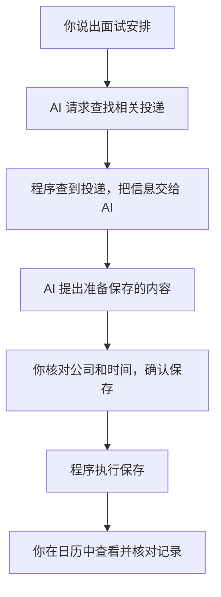
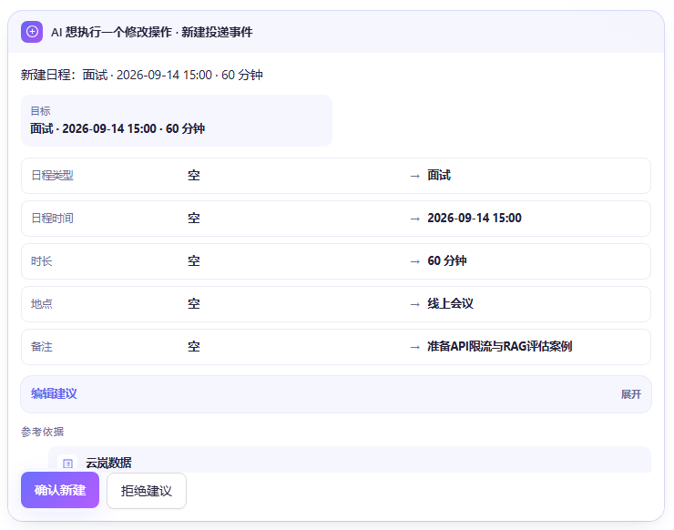
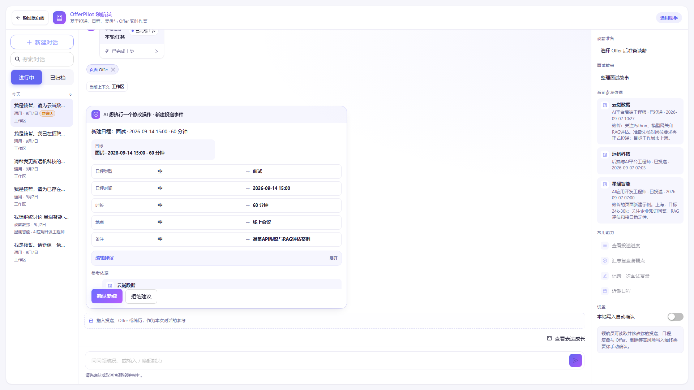
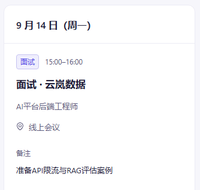
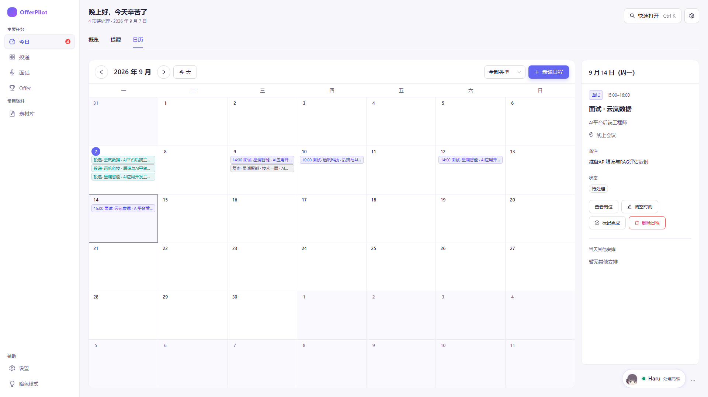

# 你说“帮我记一场面试”，AI 到底做了什么？

假设你已经在 OfferPilot 里记录了云岚数据的一条投递，也就是你正在申请的那个岗位。现在收到面试安排，你对内置助手 Pilot 说：

> 2026 年 9 月 14 日下午三点，我要参加云岚数据的线上面试，预计一小时，帮我记一下。

下面使用虚构数据，看看这句话怎样变成一条面试记录。你只需看懂过程，不用安装软件。

如果助手只回复“好的，记住了”，这件事完成了吗？先别急着下结论，我们看看一句话怎样变成一条可以查到的记录。

## 先看事情怎样完成

下面用一条简化流程，看看这个例子里各部分怎样配合。

查看可编辑的 Mermaid 图源

只看这条线也可以：**说出需求 → 找到相关资料 → 提出保存建议 → 你确认 → 程序保存 → 查看结果。**

## AI 先弄清楚你想做什么

你的话里有一家公司、一个时间和一件要办的事。AI 可以把这些信息整理成“为这条投递新增一场面试”的建议。

但它不会凭空知道你投过哪些岗位。这个例子里，它需要程序查找投递，再根据返回的信息提出建议。若同一家公司有多个岗位，或者没有找到对应投递，就需要先弄清楚是哪一条。

**AI 理解你的表达、提出下一步；程序负责从已有记录中查找信息。**

那 AI 怎么把事情交给程序？我们可以把它们之间传递的信息，翻译成一段容易理解的对话：

> **AI 向程序提出请求：**“查找云岚数据的投递记录。”
>
> **程序查找后返回：**“找到了一条对应的投递。”
>
> **AI 根据结果提出下一项请求：**“为这条投递新增面试，2026 年 9 月 14 日 15:00 开始，持续 60 分钟，地点为线上。”
>
> **程序向你展示：**“这是准备新增的内容，请核对并确认。”

这段对话是帮助理解的示意，不是旧演示的运行记录。实际传递时，会使用程序能识别的固定格式。在这个例子里，AI 不用像人一样点击按钮，程序也不需要猜它的想法。

**AI 不只是生成给人看的回复，也可以生成给程序处理的操作请求。** 程序执行相应功能，再把结果交回去；需要确认的修改则先等你同意。

## 看到准备保存的内容，还要由你核对

> **运行截图占位 B1a｜尚未采集。** 后续替换为与开头请求一致的新确认卡：云岚数据、对应岗位、2026 年 9 月 14 日 15:00、线上、60 分钟。未提供的准备事项应展示如何补充或确认，不直接沿用旧图内容。

这张旧版演示的局部截图，可以帮助你认出“准备新增的内容”和两个选择按钮。公司名称保留在卡片下方的参考依据中。

开头的教学请求明确提供了线上、一小时；旧图还含有准备事项，但本文没有提供它的来源，不能把它当成 AI 从这句话里推出来的信息。这里借旧图认识确认卡，不把它作为新教学请求的运行结果。

查看完整确认界面

这时，卡片表达的是“准备这样保存”。你核对公司、岗位和时间，决定是否执行；拒绝这次新增建议，就不应新增这场面试日程。

## 真正保存，靠的是程序

你确认之后，程序才执行获准的保存操作。然后去日历里查看：有没有这场面试？公司对吗？日期和时间对吗？

> **运行截图占位 B1b｜尚未采集。** 后续采集与新确认卡对应的保存结果，核对同一公司、岗位、日期、时区和时长。应保留未经人工事后纠正的结果；如仍出现偏差，应先记录问题，不把修正后的截图标成自动保存成功。

**旧版演示局部截图：时间曾保存错误，图中是人工修正后的结果，仅用于展示记录查看位置。**

查看完整日历界面（时间经过人工修正）

这套分工，让你不用自己逐项填写表单，也不必把修改记录的决定全部交给 AI。你用自然语言说明需求，助手整理建议，程序按规则执行，你保留确认的机会。

同时，**AI 说“记好了”，不等于数据已经正确保存。** 要看程序执行后的记录，并核对内容是否符合你的意思。

## 那么，这和一个聊天框有什么不同？

关键在它能做什么。只生成文字的助手可以告诉你“记得参加面试”；接上查询、保存功能的助手，还可以在你的确认下帮助修改实际记录。

有些聊天产品本身也具备这些功能，所以不能只看界面是不是聊天框。这里说的 Agent，可以先理解为：一个能够借助程序功能、围绕任务继续行动的 AI 助手。它也可能做错，需要有明确的执行边界。

到这里，你可以这样理解：**AI 不只是回复我一句话，它还会向软件提出操作请求；软件负责执行，而这个例子里的修改要先经过我确认。**

可选：这些部分以后会叫什么名字？

| 刚刚看到的事情 | 常见名字 |
| --- | --- |
| 理解你的话、提出下一步动作 | 模型 |
| 供 AI 调用的查询、保存功能 | 工具 |
| 当前请求和相关投递等任务信息 | 上下文 |
| 把环节接起来，管理执行、停止和出错等情况的程序 | Harness 的一部分 |

不必背下来。以后遇到具体问题，再逐渐理解它们怎样实现。

## 用自己的话说说看

如果助手说“已经安排好了”，但你还没找到日历记录，现在能确定保存成功了吗？谁提出了保存建议，谁真正执行保存？

看一个参考回答

还不能确定。AI 提出了保存建议；人核对并确认后，由程序执行保存。需要到记录里核对结果，不能只相信一句回复。

你能解释这段分工，就已经完成这一篇，不需要接着读代码。

[下一篇：它怎么知道我投过哪些公司？](02-where-information-comes-from.md) · [返回学习入口](README.md)

---

素材来源与阅读参考

完整截图原样复用自[固定版本的产品手册 §5](https://github.com/offercontext/offerPilot/blob/c0a447bbe7be8976fe9a53c2bcbf3b91dad0eeac/docs/product-manual/%E4%BA%A7%E5%93%81%E8%AF%B4%E6%98%8E%E4%B9%A6.md#s05)，原文件为 `R05-02-pilot-event-confirm.png` 和 `R05-04-page-time-corrected.png`。局部图只改变原图的显示范围，业务内容未改动。原手册将主体截图标为 `46339af` 版本，并记录了时间偏差及人工纠正。

本篇未重新运行产品验证。开头请求和 AI 与程序的对话为新编教学示意，不是旧演示的原话；图中的额外准备事项没有在本文提供来源。正式发布前，应重录一组请求、确认卡与保存结果一致的素材，明确未提供信息如何补充或确认。

本文介绍的是模型提出请求、应用程序执行功能的工具调用方式。相关机制可参考 [Claude 工具调用说明](https://platform.claude.com/docs/en/agents-and-tools/tool-use/overview#how-tool-use-works)，无需阅读其中的代码也能完成本篇。

