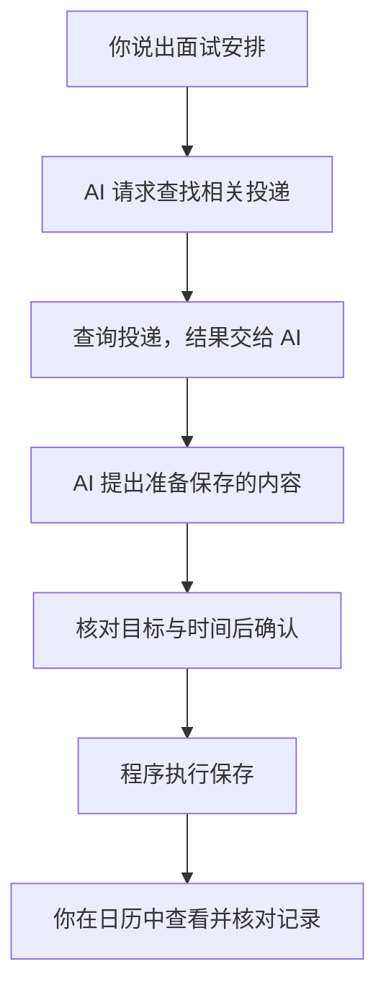
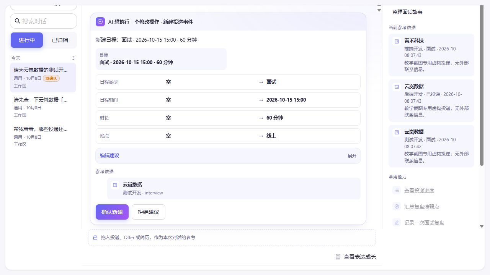

# 你说“帮我记一场面试”，AI 到底做了什么？

在下面这次实际演示里，OfferPilot 已经保存了“云岚数据 · 测试开发”的虚构投递。我们向内置助手 Pilot 发送了这条请求：

> 请为云岚数据的测试开发岗位新增面试日程：2026 年 10 月 15 日，北京时间下午 3 点（UTC+8），线上，时长 60 分钟。

下面的截图采集于 2026-10-08：使用虚构投递、隔离数据和真实模型，看看这句话怎样变成一条面试日程。你只需看懂过程，不用安装软件。

如果助手只回复“好的，记住了”，这件事完成了吗？先别急着下结论，我们看看一句话怎样变成一条可以查到的记录。

## 先看事情怎样完成

下面用一条简化流程，看看这个例子里各部分怎样配合。

查看可编辑的 Mermaid 图源

只看这条线也可以：**说出需求 → 找到相关资料 → 提出保存建议 → 你确认 → 程序保存 → 查看结果。**

## AI 先弄清楚你想做什么

你的话里有一家公司、一个时间和一件要办的事。AI 可以把这些信息整理成“为这条投递新增一场面试”的建议。

但它不会凭空知道你投过哪些岗位。这个例子里，它需要程序查找投递，再根据返回的信息提出建议。若请求和查询结果仍不足以定位目标，才需要补问；本次已经写明“测试开发”，可以据此匹配。

**AI 理解你的表达、提出下一步；程序负责从已有记录中查找信息。**

那 AI 怎么把事情交给程序？我们可以把它们之间传递的信息，翻译成一段容易理解的对话：

> **AI 向程序提出请求：**“查找云岚数据的测试开发投递。”
>
> **程序查找后返回：**“找到了一条对应的投递。”
>
> **AI 根据结果提出下一项请求：**“为这条投递新增面试，2026 年 10 月 15 日 15:00 开始，持续 60 分钟，地点为线上。”
>
> **程序向你展示：**“这是准备新增的内容，请核对并确认。”

这段对话是对分工的教学转述，不是模型与程序传递内容的逐字记录。实际传递时，会使用程序能识别的固定格式。在这个例子里，AI 不用像人一样点击按钮，程序也不需要猜它的想法。

**AI 不只是生成给人看的回复，也可以生成给程序处理的操作请求。** 程序执行相应功能，再把结果交回去；需要确认的修改则先等你同意。

## 看到准备保存的内容，还要由你核对

这张实际确认卡列出了日期、时长和地点。下方参考依据保留了公司与岗位；“确认新建”和“拒绝建议”是你接下来的两个选择。

本次请求没有提供准备事项，卡片也没有额外补写。此时只形成了保存建议，核对数据库时日程数量仍为 0。

这时，卡片表达的是“准备这样保存”。你核对公司、岗位和时间，决定是否执行；拒绝这次新增建议，就不应新增这场面试日程。

## 真正保存，靠的是程序

你确认之后，程序才执行获准的保存操作。然后去日历里查看：有没有这场面试？公司对吗？日期和时间对吗？

确认之后，日历显示了同一场面试：2026 年 10 月 15 日，云岚数据，测试开发，15:00–16:00，线上。

这次没有人工事后修改日期或时间。除了查看页面，还通过本地接口核对了同一条日程及其 60 分钟时长；截图展示的是软件里的记录，没有向招聘方发送通知。

这套分工，让你不用自己逐项填写表单，也不必把修改记录的决定全部交给 AI。你用自然语言说明需求，助手整理建议，程序按规则执行，你保留确认的机会。

同时，**AI 说“记好了”，不等于数据已经正确保存。** 要看程序执行后的记录，并核对内容是否符合你的意思。

## 那么，这和一个聊天框有什么不同？

关键在它能做什么。只生成文字的助手可以告诉你“记得参加面试”；接上查询、保存功能的助手，还可以在你的确认下帮助修改实际记录。

有些聊天产品本身也具备这些功能，所以不能只看界面是不是聊天框。这里说的 Agent，可以先理解为：一个能够借助程序功能、围绕任务继续行动的 AI 助手。它也可能做错，需要有明确的执行边界。

到这里，你可以这样理解：**AI 不只是回复我一句话，它还会向软件提出操作请求；软件负责执行，而这个例子里的修改要先经过我确认。**

可选：这些部分以后会叫什么名字？

| 刚刚看到的事情 | 常见名字 |
| --- | --- |
| 理解你的话、提出下一步动作 | 模型 |
| 供 AI 调用的查询、保存功能 | 工具 |
| 当前请求和相关投递等任务信息 | 上下文 |
| 把环节接起来，管理执行、停止和出错等情况的程序 | Harness 的一部分 |

不必背下来。以后遇到具体问题，再逐渐理解它们怎样实现。

## 用自己的话说说看

如果助手说“已经安排好了”，但你还没找到日历记录，现在能确定保存成功了吗？谁提出了保存建议，谁真正执行保存？

看一个参考回答

还不能确定。AI 提出了保存建议；人核对并确认后，由程序执行保存。需要到记录里核对结果，不能只相信一句回复。

你能解释这段分工，就已经完成这一篇，不需要接着读代码。

短路线第 1 站 · 下一站：[02 信息来源](02-where-information-comes-from.md)。

[下一篇：它怎么知道我投过哪些公司？](02-where-information-comes-from.md) · [返回学习入口](README.md)

---

素材来源与阅读参考

本篇已换为 2026-10-08 在固定源码基线 `c0a447bb` 上新采集的真实界面。使用隔离数据与 `deepseek-v4-flash`，保留默认人工确认；请求、确认卡和日历结果来自同一次操作。原先用于认识界面的旧截图不再作为本篇证据。

详细版本、运行条件、操作身份与验证结果见[本轮素材说明](images/runtime-20261008/README.md)。流程图和分工对话仍为教学示意；截图中的公司、岗位均为虚构演示数据。

本文介绍的是模型提出请求、应用程序执行功能的工具调用方式。相关机制可参考 [Claude 工具调用说明](https://platform.claude.com/docs/en/agents-and-tools/tool-use/overview#how-tool-use-works)，无需阅读其中的代码也能完成本篇。

