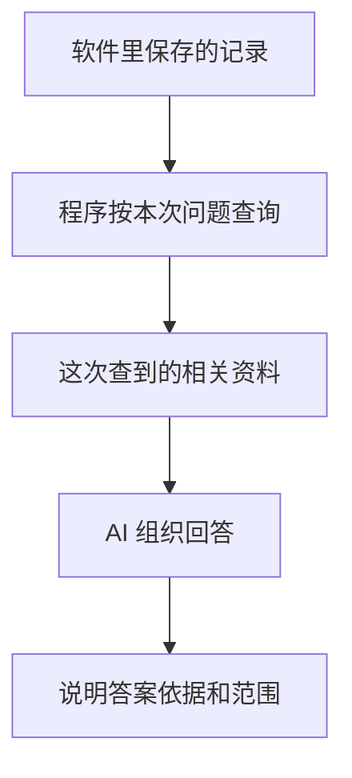
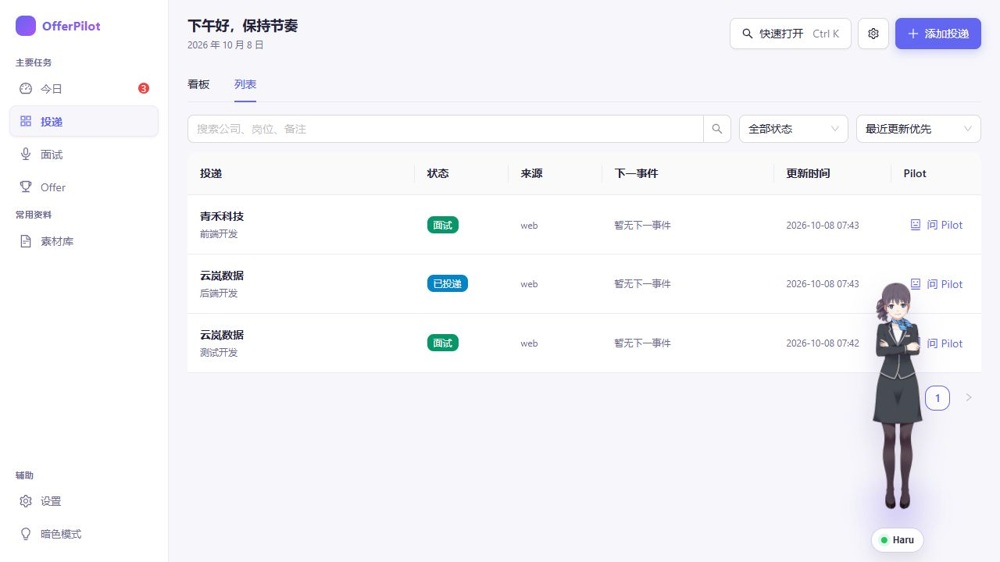
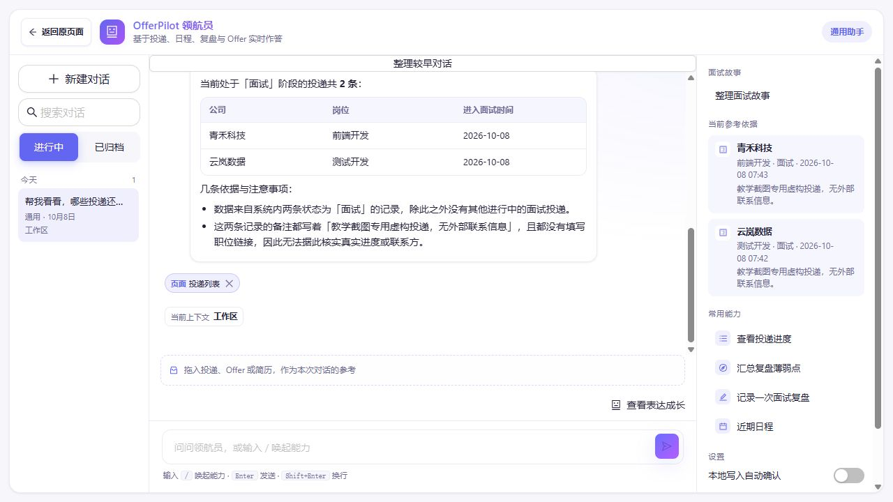

# 它怎么知道我投过哪些公司？

[上一篇](01-record-an-interview.md)里，我们看到了 AI 怎样向程序提出操作请求。这次，你只对 OfferPilot 的内置助手 Pilot 说了一句话：

> 帮我看看，哪些投递还在面试阶段？

你没有在这句话里列出公司和岗位，它该依据什么回答？下面用一组前后对照来看，不需要安装软件或读代码。

**以下记录、查询结果和回答均为虚构教学示意，不是实际运行日志。**

## 第一步：看看软件里已经存着什么

假设你之前保存了这三条投递，也就是正在申请的三个岗位：

| 公司 | 岗位 | 当前阶段 |
| --- | --- | --- |
| 云岚数据 | 测试开发 | 面试阶段 |
| 云岚数据 | 后端开发 | 已投递 |
| 青禾科技 | 前端开发 | 面试阶段 |

这些记录保存在软件里。为了回答这次的问题，助手还需要拿到其中的相关信息。

## 第二步：程序把这次相关的资料交回来

在这个例子里，AI 向程序提出查询请求：“找出当前处于面试阶段的投递。”程序按这个条件查找记录，再把结果交给 AI。

在这个简化例子里，返回的相关资料是：

> 云岚数据，测试开发，面试阶段。
>
> 青禾科技，前端开发，面试阶段。

对照上面的表，你会发现“云岚数据的后端开发岗位”没有出现在结果中，因为它在软件里仍标为“已投递”。

**软件里存着的记录，和为这次问题提供给 AI 的资料，是两件需要分清的事。** 这里展示的是助手通过查询拿到资料的一种过程。

## 第三步：AI 根据拿到的资料组织回答

拿到上面的两条结果后，AI 可以这样回答：

> 按目前保存的记录，有两条投递还在面试阶段：云岚数据的测试开发岗位，以及青禾科技的前端开发岗位。

答案里的公司和岗位来自程序查到的记录。AI 把这些资料整理成了方便你阅读的回答。

“按目前保存的记录”也很重要：这次回答依据的是软件中记录的情况，能说明的范围也到这里。

同一家公司有多个岗位时，把公司和岗位一起列出来就能避免混淆。即使它的两个岗位都在面试阶段，也可以一起列出。只有当你要求处理某一条记录，却无法确定是哪一条时，才需要进一步询问。

## 第四步：资料没拿到时，回答也要说清楚

如果查询顺利完成，但没有符合条件的记录，可以回答：

> 当前保存的投递中，没有查到处于面试阶段的记录。

如果这次未能读取记录，则应该说明：

> 这次没能读取你的投递记录，暂时无法判断。

前一种情况查过了，结果为空；后一种情况还不知道记录里有什么。因此，读取失败时不能直接说“你没有正在面试的投递”。

还有一种很日常的情况：你已经收到面试通知，却还没更新软件里的记录。助手仅凭这次查到的资料，也不能知道这个新变化。**资料能支持到哪里，回答就应该说到哪里。**

这次你问了什么，以及程序为这个问题提供了哪些资料，都是 AI 回答时可以参考的信息。它们就是“上下文”的一部分。

现在先记住这一点就够了：**保存在软件里的所有内容，并不会自动变成 AI 随时知道的事情。它需要拿到相关资料，才能据此回答。**

## 把过程画出来

下面是本例的教学流程图，用来对照上述解释，不是实际运行记录或全部产品分支。

查看可编辑的 Mermaid 图源

### 对照一组实际运行结果

2026-10-08 的隔离演示中，预先保存了三个虚构岗位：云岚数据的测试开发和青禾科技的前端开发处于面试阶段，云岚数据的后端开发处于已投递阶段。

发送“帮我看看，哪些投递还在面试阶段？请列出公司和岗位。”后，助手列出了两个处于面试阶段的岗位，右侧也显示对应参考记录。下面是聊天回答，不是工具调用日志。

公司、岗位和状态与已有记录一致；回答额外列出的“进入面试时间”未作为已验证事实。它也不能证明助手知道尚未录入的软件外信息。[运行条件与证据](images/runtime-20261008/README.md)。

## 用自己的话说说看

如果你昨天收到了一家公司的面试通知，但还没更新投递记录，助手这次没有把它列出来，可能是什么原因？

看一个参考回答

因为这次提供给它的记录里，还没有这条新信息。软件里的记录需要更新，助手拿到更新后的相关资料，才能据此回答。

[上一篇：你说“帮我记一场面试”，AI 到底做了什么？](01-record-an-interview.md) · [下一篇：为什么修改记录前，还要问我一次？](03-why-confirm-before-saving.md) · [返回学习入口](README.md)
