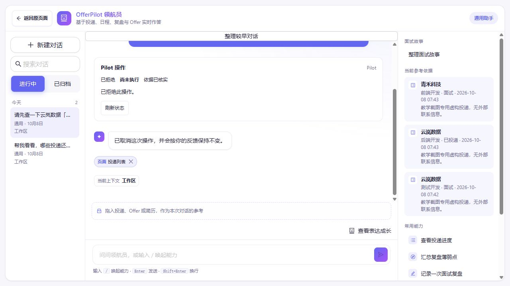

# 为什么修改记录前，还要问我一次？

你已经对助手说了“帮我改时间”，它却还要展示一次准备修改的内容，等你确认。这一步看起来像在重复提问，其实有一个具体作用：让你看见它把你的话理解成了什么。

下面继续借 OfferPilot 的面试日程来理解。**前半篇的改期例子是虚构教学示意，采用保存前由你确认的方式。** 后面的“实际点过确认，也实际拒绝过”展示独立采集的真实操作。无需安装软件。

## 第一步：你说出想做的事

假设软件里已经保存了这样一场面试：

| 公司 | 岗位 | 日期 | 时间 | 方式 |
| --- | --- | --- | --- | --- |
| 云岚数据 | 测试开发 | 2026 年 9 月 21 日 | 14:00—15:00 | 线上 |

你收到新的安排，于是说：

> 把云岚数据测试开发这场面试，改到 2026 年 9 月 22 日下午三点到四点，还是线上。

你已经表达了修改意愿。但在真正保存之前，还有一件事值得弄清楚：助手准备改的是不是这场面试，时间是不是你说的时间？

## 第二步：把理解变成一份能核对的建议

AI 拿到相关记录后，提出修改请求。程序可以把这项请求展示成下面这样的对照：

| 核对什么 | 原来的记录 | 准备改成 |
| --- | --- | --- |
| 公司和岗位 | 云岚数据 · 测试开发 | 云岚数据 · 测试开发 |
| 日期 | 2026 年 9 月 21 日 | 2026 年 9 月 22 日 |
| 时间 | 14:00—15:00 | 15:00—16:00 |
| 方式 | 线上 | 线上 |

这时展示的是**准备保存的内容**。单是看到这张表，还不能说明原记录已经改变。

如果助手误选了“后端开发”的面试，你会在公司和岗位这一行发现；如果把下午三点理解成了凌晨三点，你也有机会在保存前纠正。

确认的价值，就在于把一句“我理解了”变成你能检查的具体内容。

## 第三步：你决定这份建议能不能执行

面对同一份建议，你可以作出不同选择：

| 你的选择 | 在这个例子里意味着什么 |
| --- | --- |
| 确认这份修改 | 允许程序尝试按展示的内容修改这场面试 |
| 拒绝这份修改 | 不执行这份建议，原记录不因它而改变 |
| 说明哪里不对 | 助手需要调整建议，再让你核对调整后的内容 |

这里的“拒绝修改”也不等于取消现实中的面试，更不等于删除原日程。你只是没有同意这一次提出的改动。

**你确认的是眼前这份具体建议。** 如果你随后把时间改为下午五点，先前对“三点到四点”的确认不能被当作新时间也已确认。

这一关还需要程序落实：在本例中，没有得到对应的确认，就不执行这份修改。只让 AI 在回复里说“我会等你”，并不能替代程序对保存步骤的控制。

## 第四步：同意执行之后，还要有执行结果

确认解决的是“允不允许这样改”。接下来程序还要实际保存，并返回结果。

如果确认保存成功，才可以据此告诉你日程已更新；如果明确没有写入，就说明未完成。请求报错但暂时查不清保存结果时，要说明结果未知，不能直接当作没有写入。**点击确认，是同意开始执行，不是提前证明执行成功。**

这套配合让你可以用一句话说明需求，由助手整理修改内容，再由程序执行；你仍有机会在记录改变前检查它理解得对不对。

## 把过程画出来

下面是本例的教学流程图，用来对照上述解释，不是实际运行记录或全部产品分支。

查看可编辑的 Mermaid 图源

### 实际点过确认，也实际拒绝过

[第 1 篇](01-record-an-interview.md)展示了确认新增面试日程后，记录出现在日历里的过程。另一次演示却出了偏差：请求“先查面试安排，再新增一场”后，界面提出了“添加复盘记录”。操作者没有确认，而是写明原因并拒绝。

当时数据库中的日程和复盘记录都为 0；最终核对中，这项操作的状态为 `rejected`，复盘记录仍为 0。这里验证的是拒绝一次错误的新增建议；不是“修改已有记录后撤销”的演示。[完整条件与核对结果](images/runtime-20261008/README.md)。

## 用自己的话说说看

你想改“测试开发”的面试时间，但准备保存的内容写着“后端开发”。虽然日期和时间都正确，能直接确认吗？

看一个参考回答

不应该。目标岗位不对，确认后可能改到另一场面试。应该拒绝这份建议或说明目标有误，等正确的公司、岗位和时间都展示出来后，再决定是否确认。

[上一篇：它怎么知道我投过哪些公司？](02-where-information-comes-from.md) · [下一篇：信息不够时，为什么它要再问一句？](04-when-the-assistant-should-ask.md) · [返回学习入口](README.md)
