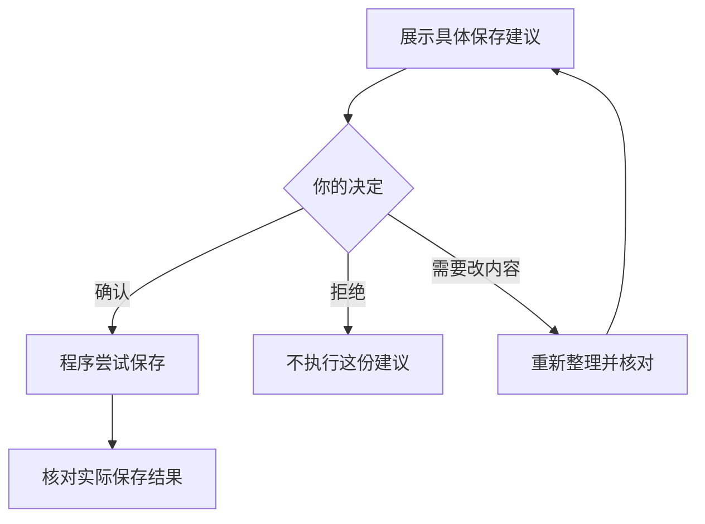

# 为什么保存记录前，还要问我一次？

你已经说了“帮我记一场面试”，助手却还要展示准备保存的内容，等你确认。这一步让你看见：它把你的话理解成了什么，接下来准备改变哪条记录。

我们继续看[第 1 篇](01-record-an-interview.md)的新增日程：云岚数据 · 测试开发，2026 年 10 月 15 日北京时间 15:00，线上，60 分钟。**下面的对照表和分支说明是教学整理，真实确认卡见第 1 篇。** 新增也会改变软件里的数据，因此同样需要确认。

## 第一步：请求已经明确，结果还没有发生

软件里已有这条投递，但尚未保存这场面试。你提出了新增请求，AI 查到目标投递后，整理出一份建议。

“我想新增”说明你的意图；“这份建议可以保存”还需要你核对实际内容。助手可能选错岗位，也可能把下午三点理解成凌晨三点。

## 第二步：把理解变成一份能核对的建议

| 核对什么 | 准备保存的内容 |
| --- | --- |
| 动作 | 新增一场面试日程 |
| 公司和岗位 | 云岚数据 · 测试开发 |
| 日期与时区 | 2026 年 10 月 15 日，北京时间（UTC+8） |
| 开始时间与时长 | 15:00，60 分钟，预计 16:00 结束 |
| 方式 | 线上 |

这时展示的是**准备保存的内容**，还不能说明日程已经存在。真实演示中，待确认时日程数量仍为 0。

确认的价值，就在于把一句“我理解了”变成你能检查的具体内容。

## 第三步：你决定这份建议能不能执行

| 你的选择 | 在这个例子里意味着什么 |
| --- | --- |
| 确认这份新增建议 | 允许程序尝试按展示的内容新增日程 |
| 拒绝这份建议 | 不执行这次新增，日程不会因它而增加 |
| 说明哪里不对 | 助手调整建议，再让你核对调整后的内容 |

拒绝建议不等于取消现实中的面试，也不等于删除其他日程。你只是没有同意这一次提出的操作。

**你确认的是眼前这份具体建议。** 如果随后把时间改为下午五点，先前对“三点开始”的确认不能被当作新时间也已确认。

这一关还需要程序落实：没有对应确认，就不执行这份新增。只让 AI 说“我会等你”，不能替代程序对保存步骤的控制。

## 第四步：同意执行之后，还要有执行结果

确认解决的是“允不允许这样保存”。接下来程序还要实际保存，并返回结果。

确认保存成功后，才可以说日程已新增；明确没有写入时，说明未完成。请求报错但查不清保存结果时，要说明结果未知，不能直接当作没有写入。**点击确认，是同意执行，不是提前证明执行成功。**

这套配合让你不用逐项填表，仍然有机会在记录改变前检查助手理解得对不对。

## 把过程画出来

下面是本例的教学流程图，用来对照上述解释，不是实际运行记录或全部产品分支。

查看可编辑的 Mermaid 图源

### 实际点过确认，也实际拒绝过

[第 1 篇](01-record-an-interview.md)展示了确认新增面试日程后，记录出现在日历里的过程。另一次演示却出了偏差：请求“先查面试安排，再新增一场”后，界面提出了“添加复盘记录”。操作者没有确认，而是写明原因并拒绝。

当时数据库中的日程和复盘记录都为 0；最终核对中，这项操作的状态为 `rejected`，复盘记录仍为 0。这里验证的是拒绝一次错误的新增建议；不是“修改已有记录后撤销”的演示。[完整条件与核对结果](images/runtime-20261008/README.md)。

## 用自己的话说说看

你想为“测试开发”新增面试，但准备保存的内容写着“后端开发”。虽然日期和时间都正确，能直接确认吗？

看一个参考回答

不应该。目标岗位不对，确认后可能把面试记到另一条投递下。应该拒绝这份建议或说明目标有误，等正确的公司、岗位和时间都展示出来后，再决定是否确认。

[上一篇：它怎么知道我投过哪些公司？](02-where-information-comes-from.md) · [下一篇：信息不够时，为什么它要再问一句？](04-when-the-assistant-should-ask.md) · [返回学习入口](README.md)
