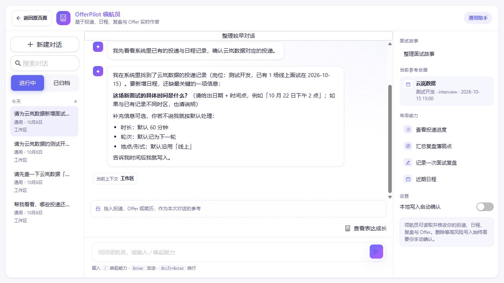

# 信息不够时，为什么它要再问一句？

第 1 篇的请求已经说明岗位、日期、时间和时长。如果省掉其中一部分，会怎样？

> 请为云岚数据新增面试日程：2026 年 10 月 15 日下午，线上。

**下面是用同一组虚构投递构造的信息缺项练习，不是另一份实测日志。** 本例已约定使用北京时间（UTC+8），没有约定具体钟点或默认时长。

## 第一步：先看看已经知道什么

查询后，软件里有两个候选投递：

| 公司 | 岗位 |
| --- | --- |
| 云岚数据 | 测试开发 |
| 云岚数据 | 后端开发 |

助手已经知道公司、日期、时区和线上方式。但还不知道为哪个岗位新增、下午几点开始、持续多久。这些缺项会改变保存结果，不能自行猜。

## 第二步：只问缺少的内容

一句有用的追问可以是：

> 查到测试开发和后端开发两个岗位。你要为哪个岗位新增？10 月 15 日下午几点开始，持续多久？

你回答：

> 测试开发，下午三点，60 分钟。

这就补齐了目标、开始时间和时长，不需要你把已明确的公司、日期和方式重说一遍。只有年份或时区确实没有依据、会影响结果时，才补问相应信息。

**好的追问会保留已有信息，让你容易补齐缺项。** 不能先猜一个岗位，再把“下午”默认为三点。

## 第三步：分清什么时候需要问

| 你提出的请求 | 这时怎样处理比较合适 |
| --- | --- |
| 列出云岚数据的投递 | 把两个岗位都列出来，不需要选一个 |
| 为云岚数据新增 10 月 15 日下午的面试 | 问清目标岗位、开始时间和时长 |
| 为测试开发新增 10 月 15 日 15:00 的线上面试，60 分钟 | 在已知年份、时区和唯一对应投递的前提下，整理待确认建议 |

列表请求本来就需要多条结果，不必追问目标；已经明确的保存请求，也不必机械重复索取信息。

如果目标明确，却读取失败，那是执行问题。助手应说明无法读取，不能把它伪装成“用户还没说清”，让你不断重述。

## 第四步：补齐信息，再核对具体建议

现在可以整理为：云岚数据 · 测试开发，2026 年 10 月 15 日北京时间 15:00，线上，60 分钟。这就回到了第 1 篇的完整请求。

采用本例的人工确认规则时，更准确的表达是：

> 信息补齐了，我会生成待确认建议；请核对完整内容后决定是否保存。

追问帮助助手**弄清你要什么**；确认让你**检查建议并决定是否执行**。回答了缺少的时间，不等于确认随后生成的所有内容。

### 实际追问，也可能只问对了一部分

**下面是一次不充分的追问：它问到了时间，却没有确认目标岗位，也提前承诺了写入。**

这张真实截图来自另一条请求：“请为云岚数据新增面试日程。”当时已有第 1 篇保存的日程。这是独立的追问观察，不是上面教学问答的实录。

先看回复中的三个位置：目标直接变成“测试开发”；时长、轮次和地点出现默认值；末句写着“告诉我时间后我就写入”。其中后一句是表达问题，不能据此断言后端确认机制已经被绕过。

本次没有继续补充或保存，日程仍为原来的 1 条。保存前应核对完整建议，不能把这张图当成标准追问范例。[运行说明](images/runtime-20261008/README.md)。

## 用自己的话说说看

你问“云岚数据有哪些投递”，程序查到了两个岗位。助手应该让你先选一个，还是可以直接列出来？为什么？

看一个参考回答

可以直接列出两个岗位。你想看的是有哪些投递，没有要求为其中一个新增日程，不需要为了展示列表而先选择目标。

[上一篇：为什么保存记录前，还要问我一次？](03-why-confirm-before-saving.md) · [下一篇：它说“完成了”，我该看哪里？](05-how-to-know-it-worked.md) · [返回学习入口](README.md)
