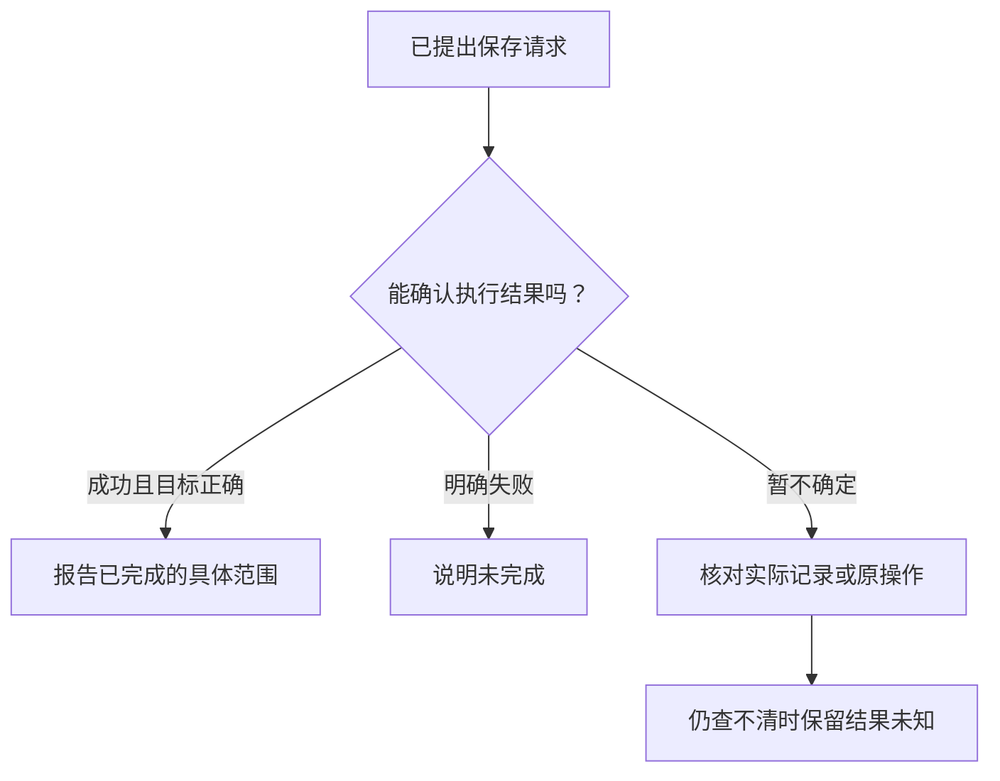
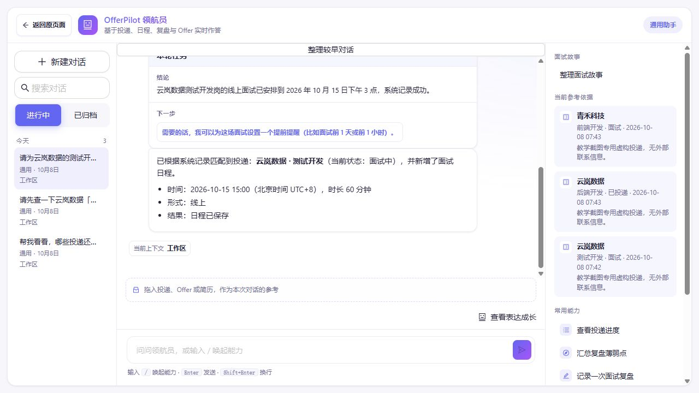
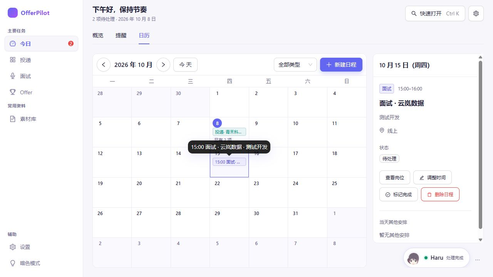

# 它说“完成了”，我该看哪里？

你让助手修改一场面试的时间，也确认了准备保存的内容。接下来，聊天里出现一句：

> 已经帮你改好了。

[第一篇](01-record-an-interview.md)提过，单凭这句话还不足以判断记录已经改变。这次我们再往前走一步：怎样看出任务进行到了哪里，以及结果究竟说明了什么？

**以下沿用虚构的面试改期场景，提示语与保存结果均为教学示意，不是实际运行日志或当前界面的原文。**

## 第一步：先区分“准备做”和“已经做”

这次任务要把云岚数据测试开发的面试，从 2026 年 9 月 21 日 14:00—15:00，改为 9 月 22 日 15:00—16:00。

你可能在不同阶段看到类似的信息：

| 看到的信息 | 现在能知道什么 |
| --- | --- |
| 准备修改为 9 月 22 日 15:00—16:00，请确认 | 修改建议已经整理好，正在等你决定 |
| 已收到确认，正在保存 | 你已同意这项修改，保存结果还没有出来 |
| 程序返回保存成功，并给出更新后的记录 | 程序报告此次保存已经完成，可以核对记录内容 |

前两种提示都有新时间，但新时间出现在聊天里，不等于它已经进入保存后的日程。

**一份建议、一句同意和一次完成的保存，分别是不同的事情。**

## 第二步：看保存结果是不是你要的结果

假设程序返回成功，你再打开保存后的这场面试记录，可以对照下面的内容：

| 核对什么 | 这次希望保存的结果 |
| --- | --- |
| 目标 | 云岚数据 · 测试开发的这场面试 |
| 日期 | 2026 年 9 月 22 日 |
| 时间 | 15:00—16:00 |

这里只看到了一个“成功”字样还不够具体。目标岗位正确、日期和时间也正确，才符合这次请求。

在这个改期例子里，应该更新原来的那场面试。如果旧时间的原记录还在，又多出一条新时间的记录，也需要进一步核对是否误做成了新增。

程序返回的保存结果，和重新打开后看到的记录，让“完成”有了可以检查的依据。助手应当根据这些结果组织回复，而不是在结果到来之前先说成功。

## 第三步：没有结果时，先弄清楚是哪种情况

没有看到成功提示，可能有不同原因。用两种情况来对照：

**程序明确说明没有保存。** 例如，在这个教学情境里，检查发现目标记录已不存在，程序在执行修改前就返回失败。助手可以说明：

> 没有找到要修改的那场面试，这次没有完成保存。需要先确认目标记录。

**等待结果时连接中断了。** 这时可能根本没保存，也可能已经保存，只是结果没有传回来。更合适的说明是：

> 暂时没有拿到保存结果，还不能确定是否完成。需要先查看这场面试的当前记录。

后一种情况不能直接说“已经失败，再来一次”。尤其在新增日程时，不先核对就重复执行，可能把同一场面试记两遍。如果当前记录也读不到，就应继续说明结果尚不确定。

## 第四步：完成到哪里，回答就说到哪里

在本例中，程序修改的是软件里保存的面试日程。因此，确认成功后可以说：

> 软件中这场面试的时间已更新为 2026 年 9 月 22 日 15:00—16:00。

这并不能证明招聘方已经收到改期通知，也不能证明对方接受了这个时间。那些事情需要各自的实际操作和结果。

把完成范围说清楚，你才知道接下来是否还有自己的事情要办。助手既要告诉你做成了什么，也要避免让一句宽泛的“都安排好了”产生额外误解。

## 把过程画出来

下面是本例的教学流程图，用来对照上述解释，不是实际运行记录或全部产品分支。

查看可编辑的 Mermaid 图源

### 把回答和日历放在一起核对

这次真实操作中，助手回复“日程已保存”，并列出了云岚数据、测试开发、2026-10-15 15:00（UTC+8）、60 分钟和线上。

随后打开日历，日期、岗位、15:00–16:00 和线上地点都一致。

本地接口也返回了同一条日程：UTC 时间 `2026-10-15T07:00:00Z`，换算北京时间为 15:00。未人工修正时间，也没有向招聘方发送消息。这组证据支持“已在本软件保存日程”，不支持“已替你通知对方”。[运行条件与记录](images/runtime-20261008/README.md)。

## 用自己的话说说看

你确认新增一场面试后，连接突然中断了。现在为什么不能仅凭“没看到成功提示”，就认定没有保存并再次新增？

看一个参考回答

因为也可能已经保存，只是结果没传回来。应先查看相应记录或查询此次操作的结果；在结果还不确定时，直接再次新增可能产生重复记录。

[上一篇：信息不够时，为什么它要再问一句？](04-when-the-assistant-should-ask.md) · [下一篇：一次任务，什么时候继续，什么时候停？](06-how-a-task-continues-and-stops.md) · [返回学习入口](README.md)
