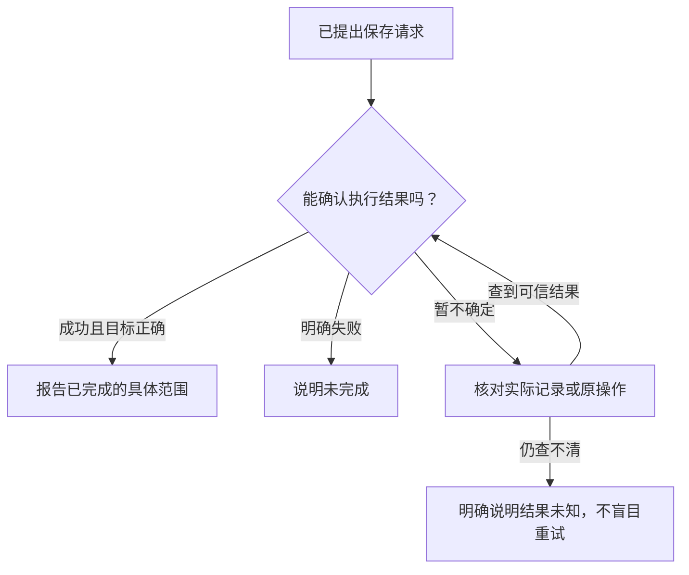

# 它说“完成了”，我该看哪里？

你确认了第 1 篇的新增建议，聊天里出现一句“日程已保存”。现在能认定任务完成了吗？要看这句话有没有实际结果支撑。

本篇继续核对同一场面试：云岚数据 · 测试开发，2026 年 10 月 15 日北京时间 15:00，线上，60 分钟。下面的提示表是教学整理；后面的回答和日历截图来自该次真实新增。

## 第一步：先区分“准备做”和“已经做”

| 看到的信息 | 现在能知道什么 |
| --- | --- |
| 准备新增 10 月 15 日 15:00 的面试，请确认 | 建议已经整理好，正在等你决定 |
| 已收到确认，正在保存 | 你已同意这项操作，保存结果还没出来 |
| 程序返回保存成功，并给出新增记录 | 程序报告已保存，可以核对内容 |

前两种提示都有面试时间，但时间出现在聊天里，不等于已经进入日程。**一份建议、一句同意和一次完成的保存，是不同的事情。**

## 第二步：看保存结果是不是你要的结果

| 核对什么 | 这次希望保存的结果 |
| --- | --- |
| 目标 | 云岚数据 · 测试开发 |
| 日期与时区 | 2026 年 10 月 15 日，北京时间（UTC+8） |
| 时间与时长 | 15:00—16:00，60 分钟 |
| 方式 | 线上 |
| 数量 | 这次只新增一条相应日程 |

只看到“成功”还不够。岗位、日期和时间都正确，且没有重复新增，才符合这次请求。这里的数量需要业务记录佐证，不能只凭一张聊天截图判断。

将来讨论改期时，判断标准会不同：应更新指定的原日程，而不是多新增一条。先分清本次要求的动作，再检查结果。

## 第三步：没有结果时，先区分失败与未知

以下是围绕同一新增请求构造的故障分支，**没有声称本次实测经历了这些故障**。

**明确没有保存。** 例如，执行前发现目标投递已不存在，程序拒绝新增。助手可以说明：

> 没有找到目标投递，这次没有保存日程，需要先确认目标记录。

**等待结果时连接中断。** 可能没有保存，也可能已经保存、只是回执没传回来。更合适的说明是：

> 暂时没有拿到保存结果，还不能确定是否完成，需要先核对原操作和当前日程。

后一种情况不能直接说“失败了，再来一次”。不先核对就重复新增，可能把同一场面试记两遍。如果记录也读不到，就继续说明结果未知。

## 第四步：完成到哪里，回答就说到哪里

确认成功后，可以说：

> 已在软件中新增云岚数据测试开发的面试日程：2026 年 10 月 15 日北京时间 15:00—16:00，线上。

它不能证明招聘方收到了通知，也不能证明对方接受了这个安排。那些事情需要各自的实际操作和结果。把完成范围说清楚，读者才不会从“记好了”误解成“对方也知道了”。

## 把过程画出来

下面是本例的教学流程图，用来对照上述解释，不是实际运行记录或全部产品分支。

查看可编辑的 Mermaid 图源

### 把回答和日历放在一起核对

这次真实操作中，助手回复“日程已保存”，并列出了云岚数据、测试开发、2026-10-15 15:00（UTC+8）、60 分钟和线上。

随后打开日历，日期、岗位、15:00–16:00 和线上地点都一致。

本地接口也返回了同一条日程：UTC 时间 `2026-10-15T07:00:00Z`，换算北京时间为 15:00。未人工修正时间，也没有向招聘方发送消息。这组证据支持“已在本软件保存日程”，不支持“已替你通知对方”。[运行条件与记录](images/runtime-20261008/README.md)。

## 用自己的话说说看

你确认新增一场面试后，连接突然中断了。现在为什么不能仅凭“没看到成功提示”，就认定没有保存并再次新增？

看一个参考回答

因为也可能已经保存，只是结果没传回来。应先查看相应记录或查询此次操作的结果；在结果还不确定时，直接再次新增可能产生重复记录。

[上一篇：信息不够时，为什么它要再问一句？](04-when-the-assistant-should-ask.md) · [下一篇：一次任务，什么时候继续，什么时候停？](06-how-a-task-continues-and-stops.md) · [返回学习入口](README.md)
