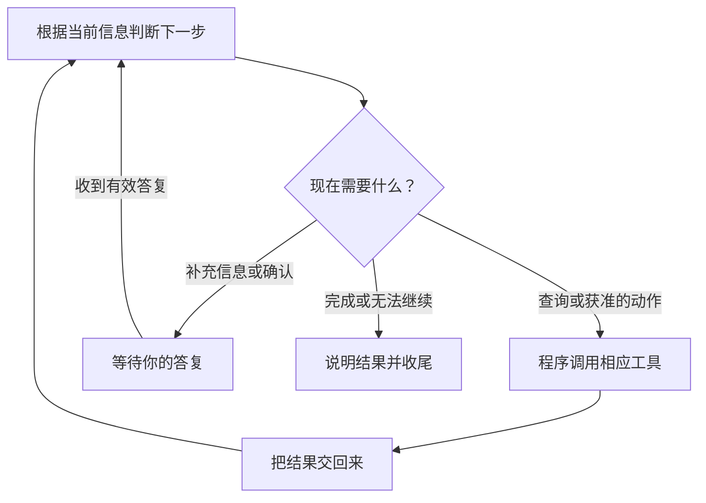

# 一次任务，什么时候继续，什么时候停？

前面几篇里，助手有时查资料，有时问你一句，有时等你确认。把这些片段连起来，会出现一个新的问题：它怎么知道现在应该做哪一步？

我们再看一次面试改期，不过这次把注意力放在**上一步的结果，怎样影响下一步**。

**以下对话和步骤均为虚构教学示意，不是实际运行日志，也不代表所有 Agent 都采用同样的顺序。** 无需安装软件。

## 第一步：从当前问题决定先做什么

你对助手说：

> 把云岚数据的面试改到 2026 年 9 月 22 日 15:00—16:00。

在这个例子里，助手还没有拿到相关面试记录。它需要先查到目标，才能提出具体修改。

把 AI 和程序之间的信息翻译成日常语言，大致是：

> **AI 提出请求：**“查找云岚数据的面试记录。”
>
> **程序查找后返回：**“有两场：测试开发和后端开发。”

这些话是帮助理解的示意。实际交给程序的请求会使用它能识别的格式；程序不会凭空读懂 AI 的想法。

## 第二步：根据查到的结果，调整下一步

既然查到了两场，就还不能直接修改其中一场。助手接着问你：

> 要改测试开发，还是后端开发的面试？

你回答：

> 测试开发那场。

现在目标清楚了，助手才可以结合已查到的记录，整理修改建议。

想象查找结果换一种情况：如果只找到唯一对应的一场面试，就不一定需要你选岗位；如果读取失败，则需要先说明无法拿到记录。**下一步要考虑真正拿到的结果，不能假定查找总会成功。**

这也解释了为什么有的任务几步就结束，有的任务中间会多一次问答。

## 第三步：需要你决定时，先等待

假设程序查到测试开发的面试原定于 2026 年 9 月 21 日 14:00—15:00，准备修改的内容就可以写成：

> 云岚数据 · 测试开发：从 2026 年 9 月 21 日 14:00—15:00，改为 2026 年 9 月 22 日 15:00—16:00。

在这个需要人工确认的例子里，程序此时展示建议并等待你的决定。等待期间，不因为 AI 又生成了一句“开始修改”，就绕过确认去保存。

你确认后，程序才执行获准的修改；如果你拒绝，就不执行这份建议。即使 AI 已经知道接下来怎样调用保存功能，也仍要遵守这里的执行条件。

所以，能继续做什么，既取决于已经获得的信息，也取决于程序允许它现在做什么。

## 第四步：有了结果，就判断是否该收尾

程序完成保存并返回结果后，助手可以说明实际结果。若这场面试已按请求更新，本次任务就可以结束。

把我们刚才遇到的几种情况放在一起看：

| 现在发生了什么 | 接下来怎样处理 |
| --- | --- |
| 查到了可用记录，仍需完成用户请求 | 根据记录继续整理下一步 |
| 不知道要改哪一场 | 询问目标，等待回答 |
| 已整理好修改内容，尚未获准 | 等待确认，不执行该修改 |
| 程序没有成功读到必要资料 | 说明问题，不假装已经拿到资料继续修改 |
| 请求已完成，结果已经明确 | 告知结果，结束本次任务 |

这里说的“停”，既包括等待你提供信息，也包括任务结束。它不意味着把之前已经保存的内容自动撤回。

任务完成后，也没有必要因为“还能做更多事”，就自动把同一公司的其他日程改掉。什么时候收尾，同样需要围绕你这次提出的请求来判断。

从这个例子里，你可以看到：**助手并非一开始就知道所有后续步骤。它拿到信息或执行结果，再决定是否还需要下一步；程序负责让请求按规则运行。**

## 把这些步骤接起来的程序，叫作什么？

回头看这场面试：模型提出查询请求后，需要程序把请求交给工具；准备修改时，需要程序等你确认；工具返回结果后，又需要程序把结果交回来，让助手继续回答。

这些环节需要一套运行支撑把它们接起来。现在可以给它一个名字：

> **围绕 AI 模型，负责准备信息、连接工具、管理执行过程的这套程序，就是我们这里所说的 Agent Harness。**

你刚刚看到的等待确认、交回结果和管理任务进程，都是它在这个例子里承担的工作。这种职责划分也可参考 [VS Code 对 Agent Harness 的说明](https://code.visualstudio.com/docs/agents/concepts/agent-harnesses)。不同产品的具体实现会有所不同。

“判断下一步 → 请求程序执行 → 拿到结果 → 再判断”则是其中的一段运行过程，常被称为 Agent Loop，也就是 Agent 的运行循环。它不必每次都走很多轮，完成当前请求就可以收尾。

下一篇，我们把你、模型、工具和 Harness 放在同一场面试里，看清它们各自负责什么。先理解这些工作，再记名字就容易了。

## 把过程画出来

下面是本例的教学流程图，用来对照上述解释，不是实际运行记录或全部产品分支。

查看可编辑的 Mermaid 图源

## 用自己的话说说看

同样是“把云岚数据的面试改到这个时间”，一次查到了唯一对应的一场面试，另一次查到了两个岗位的面试。为什么接下来的步骤不一定相同？

看一个参考回答

如果目标唯一且时间明确，就可以继续整理修改建议；如果有两场、还不知道你要改哪一场，就应先追问。助手要根据实际查到的结果决定下一步。在本例中，两种情况最终保存前都仍需要确认。

[上一篇：它说“完成了”，我该看哪里？](05-how-to-know-it-worked.md) · [下一篇：AI 背后，谁在把这些步骤接起来？](07-who-connects-the-steps.md) · [返回学习入口](README.md)
