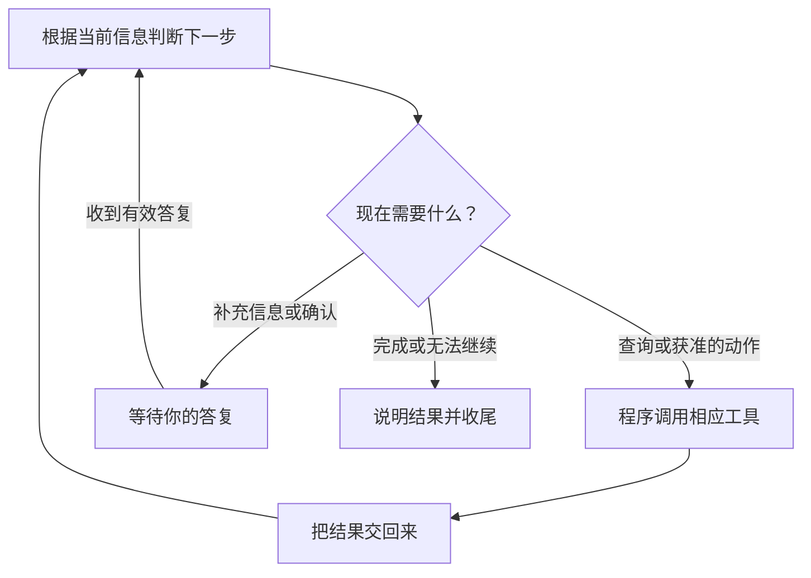

# 一次任务，什么时候继续，什么时候停？

沿着四篇短路线，你已经看过：第 1 篇中，一句请求变成了日程；第 2 篇中，投递信息来自程序查询。接下来要问：查询结束后，为什么助手还会继续？它什么时候应该等你，什么时候可以收尾？

本篇用同一场新增面试说明：云岚数据 · 测试开发，2026 年 10 月 15 日北京时间 15:00，线上，60 分钟。**步骤和对话是教学整理，分支是假设，不是完整运行日志。** 可以直接从第 2 篇读到这里，不需要先读第 3—5 篇。

## 第一步：根据请求，先取得必要信息

你提出第 1 篇的完整新增请求时，助手还需要从软件里找到对应投递。

> **AI 请求：**“查询投递。”
>
> **程序返回：**“云岚数据有测试开发和后端开发两个岗位。”

请求已经写明“测试开发”，因此这次能匹配目标。助手不用因为列表里有两个岗位，就再让你重复选择。

这些是日常语言转述。实际请求和结果使用程序能识别的格式。

## 第二步：下一步取决于拿到的结果

如果你只说“为云岚数据新增面试”，两个岗位都可能是目标，助手应追问岗位和缺少的时间；如果读取失败，它应说明问题，而不是假装找到记录。

**同一套程序不必让每个请求走同样的步骤。** 信息明确时继续整理建议；缺少关键内容时先问；无法取得必要资料时说明限制。

## 第三步：需要你决定时，先等待

完整建议是：

> 为云岚数据 · 测试开发新增 2026 年 10 月 15 日北京时间 15:00 的线上面试，60 分钟。

本例采用人工确认：程序展示这份具体建议，等待你核对。等待期间，日程尚未因这份建议新增；AI 再说一句“开始保存”，也不能替代你的确认。

确认后，程序才执行获准的新增；拒绝后，这份建议就不执行。信息补充回答和保存确认也不是同一回事：说出缺少的时间后，仍要核对完整建议。

## 第四步：结果明确后收尾

| 现在发生了什么 | 接下来怎样处理 |
| --- | --- |
| 找到目标投递，新增所需信息完整 | 继续整理建议 |
| 缺少岗位或具体时间 | 追问并等待回答 |
| 建议已形成，尚未获准 | 等待确认 |
| 必要资料读取失败 | 说明问题，不假装拿到了资料 |
| 保存结果未知 | 核对原操作，不盲目重新新增 |
| 请求已完成，结果明确 | 说明已保存的具体内容并结束 |

这里的“停”包含等待和结束，不意味着撤销已经保存的内容。任务结束后，也不能因为“还能做更多事”，就自动给后端开发岗位再加一场面试。

## 把这些步骤接起来的程序，叫作什么？

模型提出查询后，程序把请求交给工具；需要确认时，让任务等待；工具返回后，再把结果交回来。这需要一套运行支撑：

> **围绕 AI 模型，负责准备信息、连接工具、管理执行过程的这套程序，就是这里所说的 Agent Harness。**

这种职责划分也可参考 [VS Code 对 Agent Harness 的说明](https://code.visualstudio.com/docs/agents/concepts/agent-harnesses)。不同产品的实现会有所不同。

“判断下一步 → 请求程序执行 → 拿到结果 → 再判断”是其中一段运行过程，常叫 **Agent Loop**，即 Agent 的运行循环。它不必一直调用工具，完成当前请求就可以收尾。

下一篇把你、模型、工具和 Harness 放回同一场面试，看清四方的配合。

## 把过程画出来

下面是本例的教学流程图，用来对照上述解释，不是实际运行记录或全部产品分支。

查看可编辑的 Mermaid 图源

## 用自己的话说说看

同样查到两个岗位，一次请求已写明“测试开发”，另一次只说“云岚数据”。为什么不应该都先让用户再选一遍岗位？

看一个参考回答

请求已明确目标、也有对应记录时，可以继续整理建议；目标仍不明确时才追问。下一步取决于本次请求和查询结果。在本例中，无论是否追问，保存前都仍需要确认。

短路线第 3 站 · 下一站：[07 四方分工](07-who-connects-the-steps.md)。

[上一篇：它说“完成了”，我该看哪里？](05-how-to-know-it-worked.md) · [下一篇：AI 背后，谁在把这些步骤接起来？](07-who-connects-the-steps.md) · [返回学习入口](README.md)
