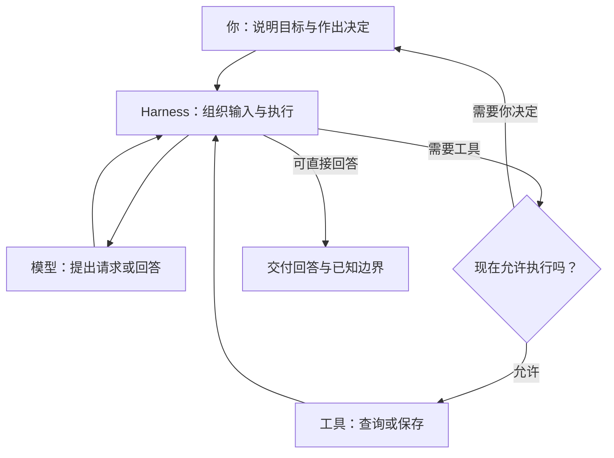

# AI 背后，谁在把这些步骤接起来？

[上一篇](06-how-a-task-continues-and-stops.md)把组织输入、工具和执行的程序叫作 Agent Harness。现在把镜头拉远：你、模型、工具和 Harness，怎样一起完成一项任务？

仍用第 1 篇的新增面试：云岚数据 · 测试开发，2026 年 10 月 15 日北京时间 15:00，线上，60 分钟。**下面是分工示意，不是逐字运行日志或完整调用栈。**

## 先把之前统称的“程序”分开看

**一类程序完成具体动作。** 比如查询投递，或新增一条面试日程。供模型请求调用的这些功能，叫作工具。

**另一类程序让过程运行起来。** 把请求和功能说明交给模型，接住它提出的动作，检查当前能不能执行，再将工具结果交回来。需要你确认时，先让任务等待。

围绕模型承担后一类工作的运行支撑，就是 **Agent Harness**。处理输入、组织工具调用和交回结果，也是 [Anthropic 对 Agent Harness 的概括](https://www.anthropic.com/engineering/demystifying-evals-for-ai-agents)。

这是职责划分，不要求它们变成几套分别安装的软件。实际项目可以把这些工作放在同一个应用里。

## 放回这场面试，看看四方怎样配合

| 谁 | 负责什么 |
| --- | --- |
| 你 | 说明目标，核对岗位、时间和方式，决定是否保存 |
| 模型 | 根据拿到的信息提出查询或新增请求，整理回答 |
| 工具 | 实际读取投递、保存日程并返回结果 |
| Harness | 准备输入、连接工具、落实执行条件、管理等待与后续运行 |

一条简化的正常过程是：

1. **你提出新增需求。** Harness 把请求和可用功能的说明交给模型。
2. **模型请求查询。** Harness 将请求交给查询工具，再把查到的目标投递提供给模型。
3. **模型提出新增建议。** 建议包含目标、时间和时长；Harness 先让应用展示建议、等待确认。
4. **你核对后确认。** 程序检查具体建议已获准，安排保存工具执行。
5. **结果交回来。** 核对保存结果并组织回执，本次任务结束。

拒绝建议就不执行这次新增；查询失败也不能假装已经找到目标。模型如果已能依据已有信息直接回答，Harness 可以交付回答，并非每轮都必须调用工具。

## 模型提出下一步，程序也有自己的规则

模型可以根据查到的信息提出追问；程序还要落实自己的执行条件。本例规定新增前需要确认，因此**模型说“现在保存”，不代表这份建议已经获准。**

日历怎样排版、投递有哪些字段，则各有产品与业务设计，不能因为它们属于同一个软件，就把整个软件都叫作 Harness。

Harness 也不自动保证每次理解正确。模型可能选错目标，资料可能过时，工具可能失败。它提供连接和控制，让结果有依据、动作有边界，问题有机会被看见。

回看这条短路线，可以用一句话连接四方：**模型提出动作，工具完成具体工作，Harness 组织它们按规则运行，你在需要时提供信息和作出决定。**

## 把过程画出来

下面是本例的教学流程图，用来对照上述解释，不是实际运行记录或全部产品分支。

查看可编辑的 Mermaid 图源

## 用自己的话说说看

如果模型已经准确理解了“新增下午三点的面试”，也生成了正确的请求，为什么还需要工具和 Harness？

看一个参考回答

理解和提出请求还没有改变记录。工具负责实际保存；Harness 负责把请求交给工具，在本例中先等用户确认，再取得并交回执行结果。它们配合起来，才能把理解变成一次受控的实际操作。

短路线到这里结束。试着不看图，解释请求怎样变成日程，以及为什么“记好了”还要有记录佐证。想回顾可看[第 22 篇总览](22-putting-the-harness-together.md)，想动手可做[最小实验](examples/README.md)。其余章节按你遇到的问题阅读。

[上一篇：一次任务，什么时候继续，什么时候停？](06-how-a-task-continues-and-stops.md) · [下一篇：给 AI 写一段要求，能改变什么？](08-what-instructions-can-change.md) · [返回学习入口](README.md)
