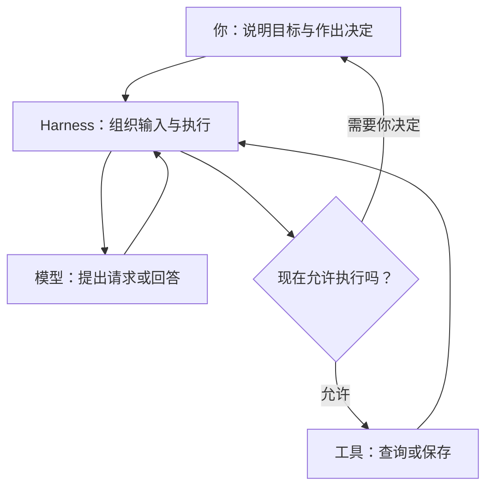

# AI 背后，谁在把这些步骤接起来？

到这里，你已经见过助手查记录、提出修改、等你确认，再告诉你执行结果。[上一篇](06-how-a-task-continues-and-stops.md)给负责连接这些环节的程序起了一个名字：Agent Harness。

这篇把镜头拉远一点：你、模型、工具和 Harness，是怎样一起完成任务的？

**下面继续使用虚构的面试改期场景说明分工，不是实际运行日志，也不是 OfferPilot 当前代码的逐步调用说明。** 不需要安装软件或读代码。

## 先把之前统称的“程序”分开看

假设软件里保存着云岚数据测试开发的一场面试，原定于 2026 年 9 月 21 日 14:00—15:00。你说：

> 把云岚数据测试开发这场面试，改到 2026 年 9 月 22 日 15:00—16:00。

之前我们说“程序负责查找和保存”。现在可以再分清两类工作：

**一类是完成具体动作。** 比如，按公司和岗位查找面试，或者把某场面试的时间保存下来。供模型请求调用的这些功能，就是前面说过的工具。

**另一类是让整个过程运行起来。** 把你的话和可用功能的说明交给模型，接住模型提出的请求，检查现在能不能执行，再将工具的结果交回来。需要你确认时，让任务等待；可以继续时，再接着运行。

围绕模型承担后一类工作的运行支撑，就是这里所说的 **Agent Harness**。处理输入、组织工具调用、交回结果，也是 [Anthropic 对 Agent Harness 的概括](https://www.anthropic.com/engineering/demystifying-evals-for-ai-agents)。

这里按职责区分工具与 Harness，帮助你看懂配合关系。实际项目可以把它们组织在同一个应用里，不需要想象成几套必须分别安装的软件。

## 放回这场面试，看看四方怎样配合

先看每一方负责什么：

| 谁 | 在这场面试改期中负责什么 |
| --- | --- |
| 你 | 说明想改哪场面试、改到什么时间，并核对和确认具体建议 |
| 模型 | 根据拿到的信息理解需求，提出查询或修改请求，整理回答 |
| 工具 | 实际查询记录或执行保存，并返回结果 |
| Harness | 为模型准备输入，连接工具，落实执行条件，管理等待和后续运行 |

同一项任务中，这些工作会交替发生。下面是一条简化的正常过程：

1. **你提出改期需求。** Harness 把这句话，以及可用的查询、修改功能说明交给模型。
2. **模型提出查询请求。** Harness 按规则把请求交给查询工具。工具找到这场面试，返回原来的日期和时间；Harness 将相关结果放进模型接下来可以参考的信息中。
3. **模型据此提出修改请求。** 请求包含具体的面试记录和新时间。在本例的人工确认规则下，Harness 先让应用展示准备修改的内容，并等待你的决定。
4. **你核对后确认。** 程序检查这份修改已获准，Harness 才安排保存工具执行。工具实际修改记录，返回保存结果。
5. **结果交回来。** 在这条示意流程里，Harness 把结果提供给模型，由模型组织回复；确认任务已经按请求完成后，这次运行结束。

如果你拒绝了第四步的修改，这份建议就不执行；如果第二步没能读取记录，也不能假定已经找到目标，照着后面的步骤继续保存。它们都是前几篇讲过的情况，现在可以看见这些分支发生在什么位置。

## 模型提出下一步，程序也有自己的规则

模型会根据当前信息判断下一步。例如，看见两个候选岗位时，它可以提出追问。

Harness 同时要落实程序设定的条件。例如，本例规定修改前需要确认，那么即使模型已经生成了完整的修改请求，也要先等待你的决定。**模型说“现在保存”，不等于这次保存已经获得许可。**

这样的配合，让模型能够根据情况调整下一步，也让软件可以明确限制哪些操作何时允许执行。你不用逐项填写表单，仍然能看见并决定准备保存的改动。

这里的 Harness 关注的是模型怎样获取信息、调用功能和完成一次任务。日历怎样排版、投递记录有哪些字段，各有自己的产品和程序设计，不能仅因为它们存在于同一个软件里，就把整个软件都叫作 Harness。

Harness 也不会自动保证每次理解和保存都正确。模型可能误解时间，原始记录可能过时，工具也可能执行失败。它的作用是为这些环节提供连接和控制，让结果能够交回来、问题有机会被看见和处理。

现在回看前几篇，“AI 需要拿到资料”“修改前要确认”“保存后要看结果”“任务何时继续或结束”，就有了一条共同的线：**模型提出动作，工具完成具体工作，Harness 组织它们按规则运行，你在需要时提供信息和作出决定。**

## 把过程画出来

下面是本例的教学流程图，用来对照上述解释，不是实际运行记录或全部产品分支。

查看可编辑的 Mermaid 图源

## 用自己的话说说看

如果模型已经准确理解了“把面试改到下午三点”，也生成了正确的修改请求，为什么还需要工具和 Harness？

看一个参考回答

理解和提出请求还没有改变记录。工具负责实际保存；Harness 负责把请求交给工具，在本例中先等用户确认，再取得并交回执行结果。它们配合起来，才能把理解变成一次受控的实际操作。

[上一篇：一次任务，什么时候继续，什么时候停？](06-how-a-task-continues-and-stops.md) · [下一篇：给 AI 写一段要求，能改变什么？](08-what-instructions-can-change.md) · [返回学习入口](README.md)
