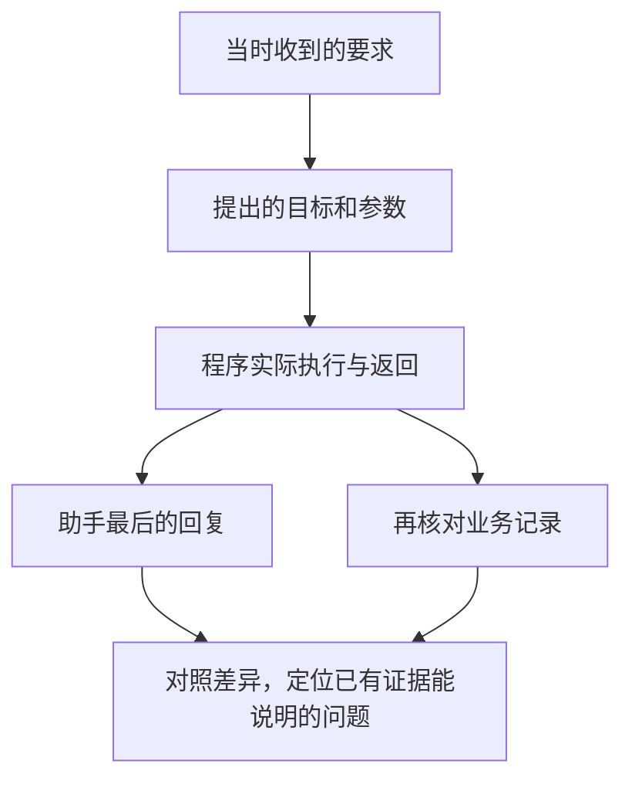
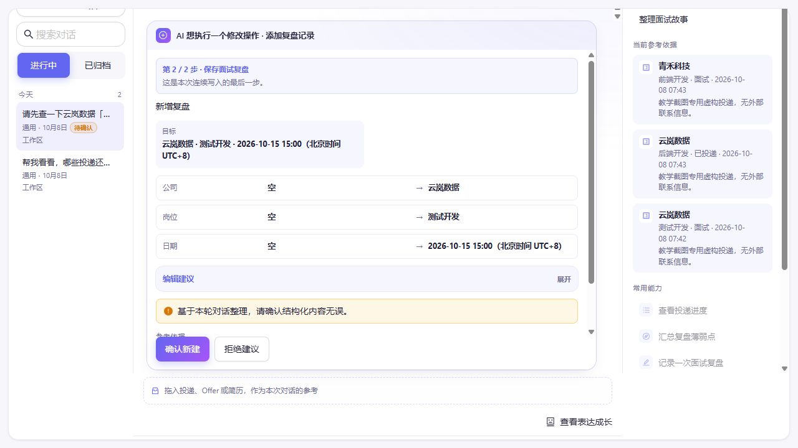

# 助手做错了，怎么找到出问题的那一步？

助手说“面试时间已经更新”，你打开日程，却发现还是原来的时间。

这时可能很想直接说“AI 理解错了”。但前面几篇已经告诉我们，一件事从理解到保存，中间还有好几个环节。只看最后一句回复，很难知道哪里出了问题。

**前半篇的改期失败情境和过程记录是虚构教学示意。** 后半篇另用真实的错误工具建议练习核对证据；两者是不同案例，不能互相当作运行记录。这篇不要求排查代码。

## 先把最后一句话放回整个过程

这次你要求把云岚数据测试开发的面试，改到 2026 年 9 月 22 日 15:00—16:00。

假设程序留下了下面这些过程记录。我们将它们翻译成日常语言，按发生顺序排好：

| 环节 | 记录下来的事情 |
| --- | --- |
| 收到请求 | 用户要求修改云岚数据测试开发这场面试，目标时间为 2026 年 9 月 22 日 15:00—16:00 |
| 查找记录 | 找到唯一对应的面试，当前时间为 2026 年 9 月 21 日 14:00—15:00 |
| 提出修改 | 模型提出修改上述记录，新时间为 2026 年 9 月 22 日 15:00—16:00 |
| 用户决定 | 用户确认了这份具体修改 |
| 调用保存功能 | 程序向保存工具传入上述目标和新时间 |
| 保存结果 | 工具明确返回：保存失败，本次没有写入修改 |
| 交回结果 | 上述失败结果已经提供给模型 |
| 最终回复 | 助手却回答：“面试时间已经更新。” |

现在再看最后一句话，就能发现它与前面的保存结果不一致。

在这份示意记录中，模型提出的目标和新时间是对的，用户也确认了；程序尝试保存，但工具报告没有完成。失败结果已经交回，最终回复却说成功了。

**这些记录帮助我们把“出了问题”说得更具体：保存没有完成，而且最终回复没有正确反映已经拿到的失败结果。**

## 能定位到哪里，就先判断到哪里

这张表还不能告诉我们保存为什么失败。它没有提供足够的错误细节，所以不能直接断定数据库坏了、网络断了，或是哪一行代码出了问题。

如果换一份记录，发现模型提出的新时间就已经不对，那么要检查的起点也会不同：它当时收到了什么信息，哪里发生了误解？

如果模型提出的是正确时间，工具报告保存的却是另一个时间，就需要继续核对请求传递、实际保存和结果展示。

这样的复盘不是为每种现象预先指定一个责任人，而是沿着实际留下的证据，缩小需要检查的范围。

## 聊天记录之外，还需要看见中间发生了什么

只保存用户说了什么、助手最后回了什么，通常看不到全部执行过程。查询了哪个目标？提出过什么修改？是否得到确认？工具返回了什么？这些才让中间的配合变得可检查。

这种按顺序保留请求、调用和结果的材料，可以叫作**运行记录**。相关技术资料也会使用 trace 或 trajectory 等名字；现在先记住它是在记录一次任务经过了哪些可观察的步骤就够了。[Anthropic 对 Agent 评估的说明](https://www.anthropic.com/engineering/demystifying-evals-for-ai-agents)也区分了执行过程记录和环境中的实际结果。

Harness 处在模型与工具之间，可以在连接这些步骤时记录必要的信息，工具和业务程序也可以提供自己的执行结果。这样，复盘时就能把一次任务的相关片段对照起来。

记录的目的，是让人看清过程。并不需要把无关的完整简历、联系方式等个人材料一并抄进日志。

## 记录也有边界

如果过程记录只写了“已发出保存请求”，之后就没有内容，我们仍然不知道保存是否完成。

可能是保存没完成，也可能是结果没有回来，或是后续过程没有成功记录。**记录中的空白，不能直接当作“这一步没有发生”的证据。** 需要再看相关记录或其他执行结果；如果仍然查不到，就说明暂时无法判断。

另外，能重新查看这张过程表，不等于可以从其中任意一行安全地再执行一次。比如保存可能已经完成时，再次新增同一场面试可能造成重复。查看过程和继续执行，是需要分别考虑的能力。

从 Harness 的角度看，让任务运行起来只是其中一部分工作。留下足够的过程信息，才能在回答不对、工具失败或结果不明时，知道下一步该查什么。

## 把过程画出来

下面是本例的教学流程图，用来对照上述解释，不是实际运行记录或全部产品分支。

查看可编辑的 Mermaid 图源

### 一次真实的错误建议

**下面是找错练习，不是正确保存日程的范例。** 用户的请求是：先查询云岚数据测试开发岗位已有的面试安排，再新增 2026 年 10 月 15 日北京时间 15:00 的线上面试，60 分钟。

先看图中的“操作类型”和“目标内容”：哪一处已经偏离用户要求？此时应该确认，还是拒绝？

展开核对过程

| 证据顺序 | 能作出的判断 |
| --- | --- |
| 用户要先查安排，再新增日程 | 目标是面试日程，不是写复盘 |
| 建议显示“添加复盘记录” | 保存前就已发生工具选择或建议类型偏差，日期正确也不能直接确认 |
| 操作者写明原因并拒绝 | 这份建议没有获得执行许可 |
| 操作账本为 `add_note / rejected`，复盘表仍为 0 | 支持“这份错误复盘建议未执行” |

已有证据不能把根因直接归到某段提示词或一次模型调用，因为这项任务的细粒度日志没有完整留下。不能用猜测补齐日志，也不能把后来另一次新增成功解释成这次没有出错。[拒绝截图和只读核对输出](images/runtime-20261008/README.md)。

## 用自己的话说说看

一份运行记录只显示“已经调用保存功能”，没有保存结果。能据此认定已经保存成功，或者一定没有保存吗？

看一个参考回答

两者都不能确定。它只能说明记录到了调用这一步。还需要保存结果或对当前记录的核对；缺少后续信息时，应保留“结果尚不确定”的判断。

[上一篇：为什么不把所有资料都交给 AI？](10-why-context-needs-selection.md) · [下一篇：没成功，再试一次就行吗？](12-when-retrying-is-safe.md) · [返回学习入口](README.md)
