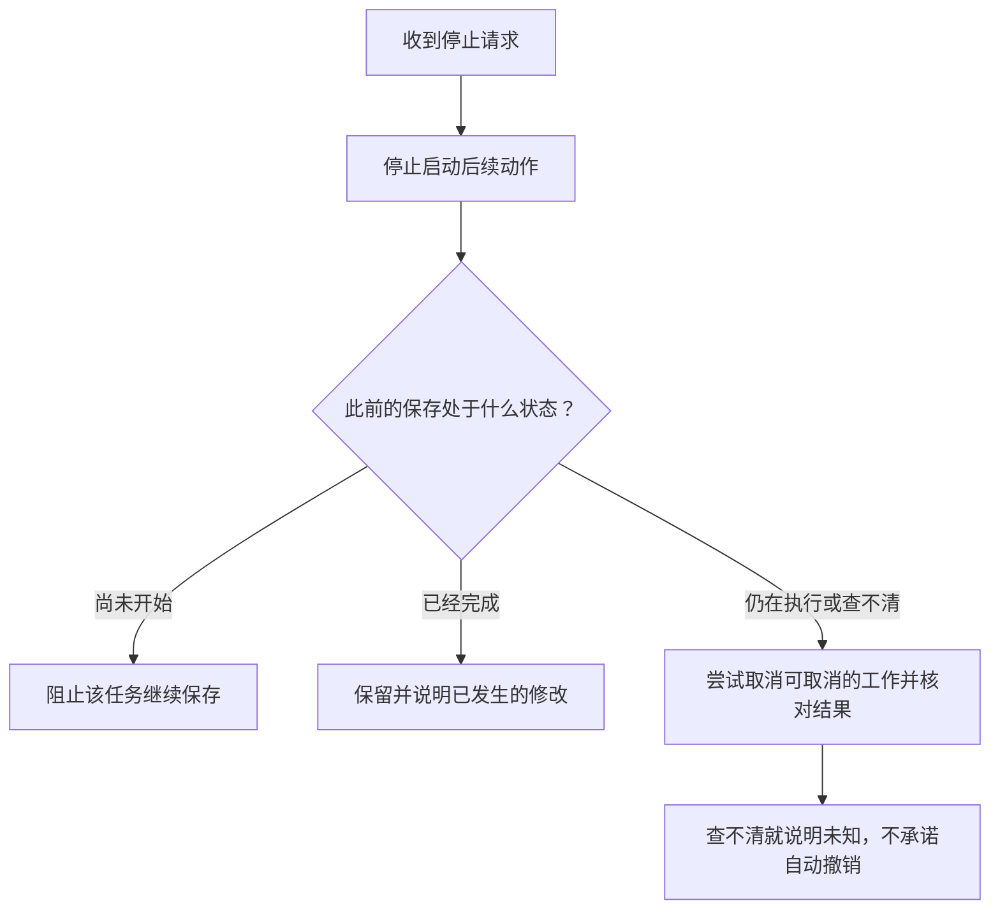

# 我点了停止，为什么还可能看到结果？

助手正在处理面试改期，你临时决定先不改，于是点击停止。但过了一会儿，页面又出现了工具返回的结果。

这是“停止没用”吗？要先看点击停止时，任务走到了哪一步。

**以下时序与处理方式均为虚构教学示意，不代表 OfferPilot 当前停止按钮的具体实现或已验证效果。**

## 停止请求到达时，事情可能已经发生了

假设程序原本要把面试改到 2026 年 9 月 22 日 15:00—16:00。

| 停止时的进度 | 程序需要怎样处理 |
| --- | --- |
| 还在整理建议，保存尚未开始 | 停止继续推进这次修改 |
| 已确认，保存正在执行 | 尝试取消可取消的工作，并核对保存结果 |
| 保存已完成，只是结果尚未显示 | 如实说明已经完成，不能宣称从未修改 |
| 保存请求已发出，暂时查不到结果 | 停止后续动作，并说明结果尚不确定 |

你点击按钮、程序收到停止请求、工具完成保存，这几件事可能发生得很接近。停止请求未必比已经发出的保存更早到达。

这种时间差在工具通信中也存在。例如 [MCP 的取消说明](https://modelcontextprotocol.io/specification/2026-07-28/basic/patterns/cancellation)就考虑了请求已完成或无法取消的情况。这里借它解释一般问题，并不要求你先学习这个协议。

## 停止不能只发生在聊天界面上

如果界面只是停止显示文字，后台仍照常执行后面的工具调用，用户的意图就没有得到落实。

Harness 需要把“这次任务已要求停止”传给相关执行环节，不再启动后续动作，并请求正在工作的工具尽可能停止。对于尚未落地的本地修改，执行程序也需要在实际保存前检查这次执行是否仍有效。

这些检查要与保存过程配合，不能只在很早以前看一次“允许执行”，之后就一直沿用。外部服务能否中断、已经提交的修改能否撤回，则取决于对应功能，不能由一个停止按钮统一保证。

## 迟到的结果可以核对，不能偷偷重启任务

假设你已经停止，较早发出的查询结果这时才回来。它可以作为核对过程的信息，但不应让旧任务自动继续生成并保存一份新修改。

如果迟到的是已经完成的保存结果，程序仍应保留这个事实，让你知道当前记录是什么状态。**不继续旧任务，和隐瞒已经发生的修改，是两回事。**

还要区分不同次任务：你后来重新提出的请求，不能被旧任务的结果覆盖；旧任务也不能借新任务的运行状态恢复执行。

## 想改回去，是另一个动作

如果保存已经完成，你可以再提出“把时间改回原来的安排”。但程序需要检查当前记录、展示准备改回的内容，并按相应规则执行。

“停止”表示不再继续当前任务；“撤销”则是在处理已经产生的结果。理解这一区别，才能读懂“已停止，但此前的保存已完成”这样的状态说明。

Harness 的停止控制，重点是让当前执行失去继续推进的资格，并把已发生或尚不确定的结果说明白。

## 把过程画出来

下面是本例的教学流程图，用来对照上述解释，不是实际运行记录或全部产品分支。

查看可编辑的 Mermaid 图源

> **运行截图占位 B13｜尚未采集。** 后续标明停止发生的时点、返回状态和最终日程。停止前已提交与尚未提交分别录制；不能用停止按钮的外观推断数据库未修改。

## 用自己的话说说看

你点停止之前，面试时间已经保存成功，只是界面还没收到结果。程序能告诉你“已停止，所以记录肯定没改”吗？

看一个参考回答

不能。它应该说明停止了后续工作，同时如实报告此前已经保存的修改。如果想改回去，需要处理一次新的修改，不能把停止等同于自动撤销。

[上一篇：没成功，再试一次就行吗？](12-when-retrying-is-safe.md) · [下一篇：刷新页面后，助手怎样接着做？](14-how-a-task-can-resume.md) · [返回学习入口](README.md)
