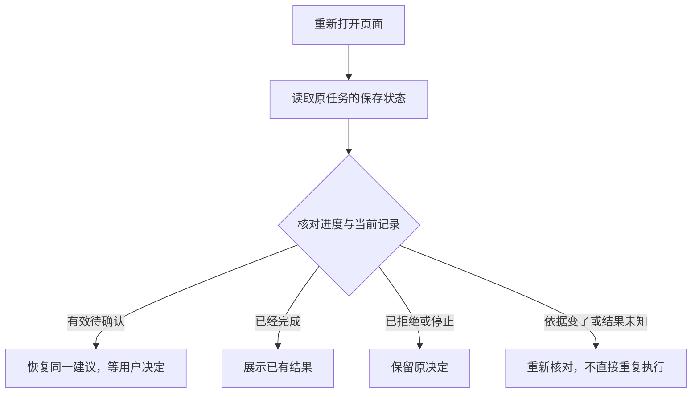

# 刷新页面后，助手怎样接着做？

助手展示了一份面试改期建议，还在等你确认。你刷新页面，再回来时，软件怎样知道应该继续等确认，而不是从头新增一次？

只把聊天文字重新显示出来，还不足以回答这个问题。

**以下任务状态与恢复过程均为虚构教学示意，不是 OfferPilot 当前恢复流程的运行验收。**

## 记下“做到哪里”，比记住最后一句话更具体

假设待确认的是把云岚数据测试开发的面试，从 2026 年 9 月 21 日 14:00—15:00 改到 9 月 22 日 15:00—16:00。

为了接着处理，程序需要保存类似下面的信息：

| 需要留下什么 | 为什么有用 |
| --- | --- |
| 这是哪个用户的哪次任务 | 找回正确的工作，避免串到别的会话 |
| 准备修改哪条记录、具体改成什么 | 恢复同一份建议，而不是重新猜一次 |
| 正在等确认、已经拒绝，还是已经执行 | 决定现在允许走到哪一步 |
| 相关操作及已有结果 | 识别已经做过的事，避免重复执行 |
| 生成建议时目标记录的状态 | 继续时检查依据有没有变化 |

这种“当前任务走到哪里”的信息，叫作任务状态。程序可以在合适的位置保存一份状态，供之后恢复；技术资料里常叫 checkpoint，即检查点。[LangGraph 的持久化说明](https://docs.langchain.com/oss/python/langgraph/persistence)展示了这一类做法。

状态需要保存在刷新或服务重启后仍能找到的地方。页面里显示过一张卡片，或者只在临时内存中留了几个变量，都不自动等于具备持久恢复能力。

## 恢复的第一步，是核对现在的情况

回来之后，可能有几种不同处理：

| 找回的状态 | 接下来应考虑什么 |
| --- | --- |
| 建议仍待确认，目标记录未变 | 恢复展示同一份建议，继续等待用户决定 |
| 这项操作已经完成 | 展示已有结果，不从头再保存 |
| 用户已经拒绝或停止 | 保留这个决定，不因为刷新就继续 |
| 保存结果未知 | 先核对实际结果，不能把未知当成未执行 |

恢复界面和恢复执行因此是两步：先找回并展示已知状态，再判断什么操作现在还能继续。

## 等待期间，原记录也可能变化

假设你在另一个页面把这场面试改到了下午五点。旧确认卡仍写着“从下午两点改到三点”，它依据的记录已经过时。

程序应该重新核对差异，不能用旧建议悄悄覆盖你刚刚的新修改。需要调整建议时，应把新的具体内容展示出来，再按规则确认。

只在打开卡片时检查一次也不够；真正写入时，仍要防止记录在检查后又变化。你现在不必学习数据库原理，先理解这是在避免“根据旧情况覆盖新结果”。

## 聊天、运行记录和可恢复状态各有作用

聊天帮助你回看交流；[运行记录](11-how-to-follow-an-execution.md)帮助复盘发生过什么；可恢复状态告诉程序目前还有什么可以做。它们可以关联起来，但不能只因为保存了聊天，就声称任务能安全地继续。

Harness 负责读回状态、恢复必要上下文，并与业务程序一起检查继续执行的条件。确认也要对应到具体任务和建议，不能从历史里一句“好的”推断当前所有修改都已获准。

## 把过程画出来

下面是本例的教学流程图，用来对照上述解释，不是实际运行记录或全部产品分支。

查看可编辑的 Mermaid 图源

> **运行截图占位 B14｜尚未采集。** 后续用同一项待确认任务记录刷新前后界面，核对建议内容和已保存状态。刷新页面、浏览器断线与服务重启分别标注，不能互相代替。

## 用自己的话说说看

刷新后重新显示了待确认卡，但程序没有保存这份建议对应的操作和执行状态。仅凭这张卡重新出现，能证明恢复已经做好了吗？

看一个参考回答

不能。还需要知道这是不是同一份建议、是否已经确认或执行、目标记录是否变化。恢复展示不等于恢复安全执行，程序必须先核对这些状态。

[上一篇：我点了停止，为什么还可能看到结果？](13-what-stop-really-means.md) · [下一篇：上次说过的事，助手为什么不一定记得？](15-what-it-means-to-remember.md) · [返回学习入口](README.md)
