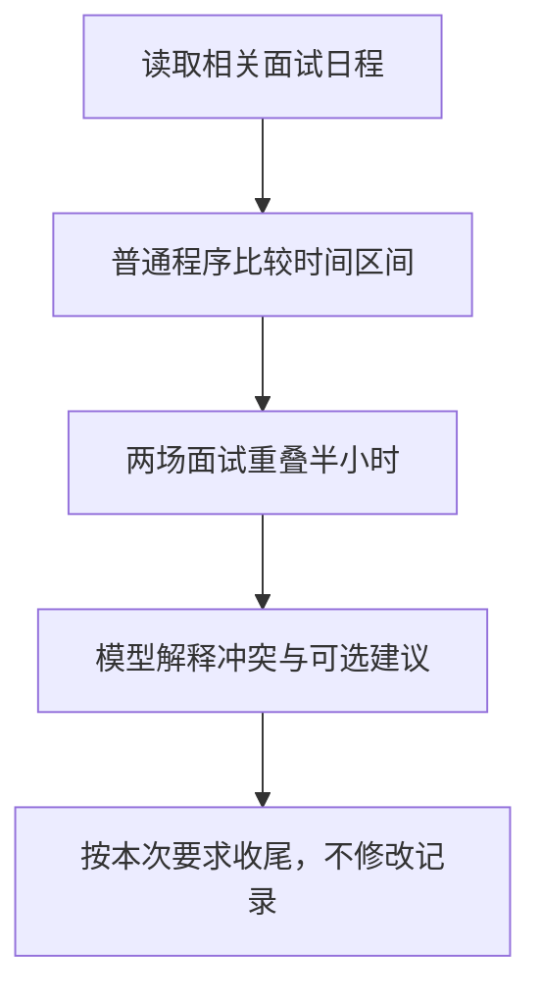

# 一句话里有好几件事，应该怎样安排？

你说：

> 帮我看看 2026 年 9 月 21 日到 27 日的面试有没有时间冲突，给我建议，先别修改记录。

这句话包含查询、比较和建议，还明确限制了操作范围。助手需要把它们安排成能完成请求的一组步骤。

**以下日程、分工与执行顺序均为虚构教学示意，不代表 OfferPilot 当前具备完整的冲突检测功能。例中时间均按同一时区理解。**

## 先找到前后依赖

假设查询返回两场面试：

| 公司与岗位 | 日期 | 时间 |
| --- | --- | --- |
| 云岚数据 · 测试开发 | 2026 年 9 月 22 日 | 15:00—16:00 |
| 青禾科技 · 前端开发 | 2026 年 9 月 22 日 | 15:30—16:30 |

先拿到日程，才能比较时间；知道重叠在哪里，才有依据给建议。因此这里可以安排为：

> 查找这段日期内的面试 → 比较时间区间 → 说明冲突并给出建议。

这份安排不包含保存。用户已经说了“先别修改”，不能因为发现冲突，就自动增加一个改期步骤。

## 有些判断交给普通程序更合适

“15:00—16:00 与 15:30—16:30 是否重叠”有明确规则，普通程序就能计算。模型可以根据结果解释：两场面试有半小时重叠，需要与招聘方核实可调整的时段。

具体选择哪家公司先沟通，则可能需要用户偏好和更多信息。模型可以整理选项，不应把猜测的可用时间当作对方已经同意。

因此，一个有 Agent 的产品，仍然会包含很多确定性的程序步骤。不必把日期计算、权限检查和保存条件全部交给模型判断。

## 固定流程和临场决定，可以配合

对于明确的任务，应用可以预先规定查询和计算步骤；对于不明确的请求，模型可以先判断需要补充什么，再选择工具。

技术资料中，预先规定的路径常被称为工作流；由模型根据情况决定下一步，则体现了 Agent 的动态行为。[Anthropic 对工作流与 Agent 的区分](https://www.anthropic.com/engineering/building-effective-agents)介绍了这种差别。它们可以出现在同一个产品中。

Harness 负责协调这些步骤，把结果传给需要它的下一步，并落实当前任务的限制。写下一份计划只是表达准备怎么做，不等于其中的步骤已经执行。

## 能同时做的事，也要先看是否互相影响

如果读取两家公司的资料互不依赖，而且权限和资源允许，可以同时查询，再汇总结果。这种同时进行的安排常叫并行。

但“先查到目标，再修改它”有明显依赖，不能为了快就同时开始。两个修改如果会影响同一条记录，也需要协调，避免相互覆盖。

并行不是为了让工具调用数量看起来更多，而是在不破坏依赖和规则的前提下减少等待。某一路失败时，也需要说明结果是否仍完整，不能把另一条成功结果当作全部任务已完成。

在本例中，读到两场面试、算出重叠并提出建议，就可以收尾。以后用户提出具体改期要求时，再进入对应的确认与保存流程。

## 把过程画出来

下面是本例的教学流程图，用来对照上述解释，不是实际运行记录或全部产品分支。

查看可编辑的 Mermaid 图源

## 用自己的话说说看

助手已经准确算出了半小时冲突。它能为了让计划“完整”，直接把第二场面试推迟一小时吗？

看一个参考回答

不能。用户要求先看冲突和建议，而且明确说了不要修改。算出冲突只是提供依据，不代表知道双方可用时间，也不代表获得了改期授权。

[上一篇：换一个模型，助手就能直接接着用吗？](18-what-changes-when-models-change.md) · [下一篇：怎么知道助手真的变可靠了？](20-how-to-check-an-agent.md) · [返回学习入口](README.md)
