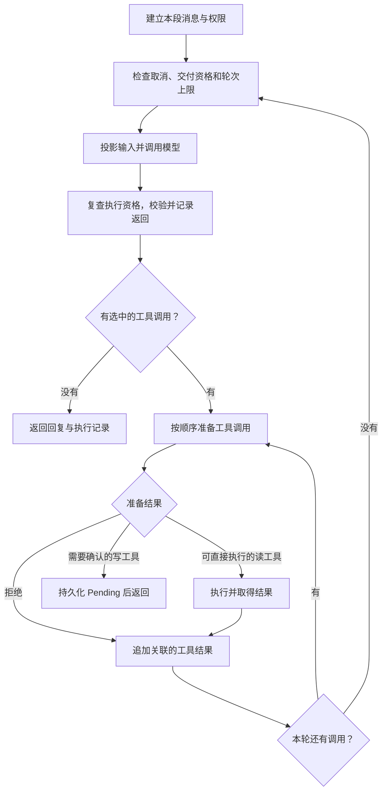
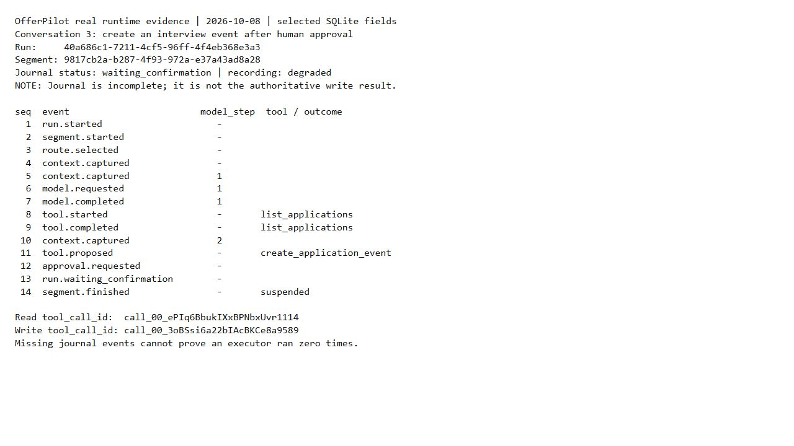

# 进阶一：拆开 Agent Loop，看看每一轮到底做了什么

入门篇已经说明“模型提出动作，程序执行”。现在往下走一层：执行结果怎么回到模型？模型一次提出两个工具调用怎么办？等待确认为什么会让这次循环返回？

本篇需要能读懂简单的 Python 条件和循环，不要求先熟悉 OfferPilot 的全部目录。源码基线与图的性质见[进阶入口](README.md)。前半篇的对话和消息表是教学示例；“从真实运行记录看一次循环”使用独立采集的实际记录。

## 先区分三个“轮次”

用户说一次话，未必只调用一次模型。假设已有云岚数据的测试开发投递，你说：“查询这条投递的面试安排，再帮我新增一场线上面试。”

| 名字 | 本篇中的含义 | 不要混同 |
| --- | --- | --- |
| 用户的一次任务 / Turn | 围绕这次提交保存的任务身份 | 不等于一次 HTTP 连接 |
| 一次逻辑模型步 / model step | 用本步输入向模型取得一次有效返回，供循环继续判断 | 不等于一次实际 Provider 请求或整个任务 |
| 一段执行 / Segment | 在当前上下文、工具和权限条件下推进的一段工作 | 确认前后的权限不必相同 |

一次用户任务可以经历“查记录 → 整理建议 → 等确认 → 执行写入”。其中查记录后，需要把结果交给模型，它才有依据整理下一步。循环发生在这里。

同一个模型步可能因 Provider fallback 向不同服务商发起多次请求，并复用同一份冻结输入。因此，模型步数不能直接当作实际请求次数或费用次数；后者另受 Runtime 调用预算约束。

## 最小循环长什么样

下面是教学伪代码，只展示控制流，不能直接运行，也没有实现真实的审批、持久化和并发控制：

```python
messages = [user_request]
for step in range(max_model_steps):
    check_task_is_active()
    assistant = model.complete(messages, visible_tools)
    check_task_is_active()
    messages.append(assistant)

    if not assistant.tool_calls:
        return final_answer(assistant.content)

    for call in select_calls(assistant.tool_calls):
        prepared = validate_and_prepare(call)
        if prepared.needs_confirmation:
            save_pending(prepared)
            return waiting_for_confirmation(prepared)
        result = execute_or_report_rejection(prepared)
        messages.append(tool_result(call.id, result))

raise ModelStepLimitReached()
```

这里有两个容易漏掉的动作：**把助手提出的调用加入消息序列，再把对应的工具结果加入消息序列**。如果只执行工具、不把结果交回去，下一次模型调用就不知道程序查到了什么。

## OfferPilot 的主循环

下图依据 `AgentLoopRunner._run` 和 `_dispatch` 绘制，省略内部适配与异常类型；它描述控制分支，不是一次实际运行截图。



<details>
<summary>查看可编辑的 Mermaid 图源</summary>



</details>

`run()` 负责取得和释放这一段使用的工具目录租约；`_run()` 负责循环；`_dispatch()` 负责将调用送入工具处理流程。可以先读这三个入口，再看它们调用的辅助方法。

读到 `while True` 不代表没有上限。该版本的默认 `DEFAULT_MAX_ITERATIONS` 为 **20**；检查对象是本段循环的模型步数。超出后抛出异常，由外层处理任务结果。它不是“整项任务最多执行 20 个工具”的保证，Runtime 还有独立的时间和调用预算。

## 消息为什么必须成对

一次查询可以抽象为下面三条信息。字段经过简化，结果不是实际数据库输出：

| 顺序 | 消息 | 关键关联 |
| --- | --- | --- |
| 1 | assistant 请求 `list_application_events` | `tool_call_id = read-1`，参数包含目标投递 |
| 2 | tool 返回查到的面试列表 | `tool_call_id = read-1` |
| 3 | assistant 根据列表提出下一步 | 读取前两条后再生成 |

`tool_call_id` 告诉模型和程序“这个结果回答的是哪一次调用”。不能只把结果拼成一条无来源的普通聊天消息，尤其不能把失败结果对应到另一项操作。

实际 `_run()` 构造助手消息时还保留 `provider_blocks`。这是服务商特定的内容，不等于给用户显示的正文。随意丢弃它，再假定所有模型都能继续这段会话，可能破坏服务商要求的协议。

## 一次返回多个调用，不代表并行执行

`_select_tool_calls()` 的当前策略是：如果没有已知写操作，保留该批调用；只要包含已知写操作，就只保留列表的第一项。未知工具仍受此前的模型返回校验和后续工具校验约束，不能因此执行。

| 模型这一轮提出什么 | 当前选择 | 随后怎样推进 |
| --- | --- | --- |
| 查询投递、查询笔记 | 都保留 | `_dispatch()` 的 `for` 循环顺序处理 |
| 新增面试、查询笔记 | 只保留第一项 | 新增建议进入待确认 |
| 查询投递、新增面试 | 只保留第一项查询 | 其余项不作为已安排队列自动执行；后续由模型根据结果继续 |

所以，“支持一轮多个读调用”和“并行工具执行”是不同能力。这里的保守选择限制了同一批次混合读写的复杂度；这是本项目这一版本的策略，不是所有 Agent 必须采用的规则。

工具错误也不是同一种终止方式。普通校验拒绝或被映射为 `ToolFailure` 的读错误，可以成为工具结果继续交回模型；取消、权限阶段失配、输入投影完整性异常等不能一律吞掉，再伪装成空列表继续。

## 确认之后，不是让模型重新猜要写什么

初次写调用返回 `PendingAction`。用户批准后，入口使用 `ApprovedWriteSeed`，由 `_bootstrap_approved()` 重新准备并核对那份 Pending，执行获准的具体操作，然后记录工具结果。

必要时才进入新的后续执行段。代码还支持成功写入后直接收尾的 `stop_after_approved_write` 分支。因此不能把它画成“每次确认之后必定先再问一遍模型，然后由模型重新生成写参数”。

这一安排让已批准的动作保持身份，避免“用户确认了下午三点，下一次模型却重新生成下午五点”的替换问题。它仍需要第三篇所讲的事务和参数校验。

## 顺着源码验证两件事

| 阅读入口 | 重点看什么 |
| --- | --- |
| [AgentLoopRunner._run](https://github.com/offercontext/offerPilot/blob/c0a447bbe7be8976fe9a53c2bcbf3b91dad0eeac/src/offerpilot/ai/agent_loop.py#L1629) | 消息追加、模型步数、返回回复或 Pending |
| [_dispatch](https://github.com/offercontext/offerPilot/blob/c0a447bbe7be8976fe9a53c2bcbf3b91dad0eeac/src/offerpilot/ai/agent_loop.py#L1906) | 读工具执行与写工具暂停 |
| [_select_tool_calls](https://github.com/offercontext/offerPilot/blob/c0a447bbe7be8976fe9a53c2bcbf3b91dad0eeac/src/offerpilot/ai/agent_loop.py#L2384) | 多调用选择策略 |
| [现有 Runner 测试](../../../tests/agent_loop/test_runner.py) | 固定返回的 `ScriptedModel` 与执行次数断言 |

在已安装本项目开发依赖的环境中，从仓库根目录运行：

```sh
python -m pytest -q tests/agent_loop/test_runner.py::test_write_tool_pauses_before_execution tests/agent_loop/test_runner.py::test_executes_multiple_read_only_tool_calls_from_one_assistant_turn
```

第一项断言写 executor 尚未调用而 Pending 已产生；第二项断言两个读取按顺序执行，工具结果保留各自 ID。这检查的是程序控制流，不能据此声称真实模型一定会选择正确工具。

### 从真实运行记录看一次循环

本次请求为云岚数据测试开发岗位新增面试日程。下面的输出来自隔离数据库中的真实 Run / Segment；能看到第 1 个模型步之后，`list_applications` 开始并完成，随后出现第 2 个模型步的上下文快照，最后 `create_application_event` 被提出并等待确认。



这张图是只读查询输出的排版截图，不是产品日志面板。该 Run 的 `recording_status=degraded`，例如第 2 步的模型请求和完成事件没有齐全记录；不能把这 14 行当作完整轨迹，也不能据缺失行断定某个 executor 没执行。可对照[真实确认卡](../images/runtime-20261008/05-interview-pending.jpg)、[原始选取字段](../images/runtime-20261008/evidence.json)及[采集说明](../images/runtime-20261008/README.md)。

## 练习：给下一轮留下什么

模型一次提出两个读调用，第一个失败、第二个成功。下一次模型输入里，能只留下成功结果吗？

<details>
<summary>参考思路</summary>

不能随意漏掉失败调用的对应结果。需要保持调用与结果的关联，让模型知道哪些资料没查成功。可以改变错误的公开表达，但不能把失败变成“没有记录”，也不能破坏工具消息配对。对应测试是 `test_failed_first_read_does_not_block_second_read_in_same_turn`。

</details>

[下一篇：Harness 怎样拆分职责](02-harness-boundaries.md) · [返回进阶入口](README.md)
