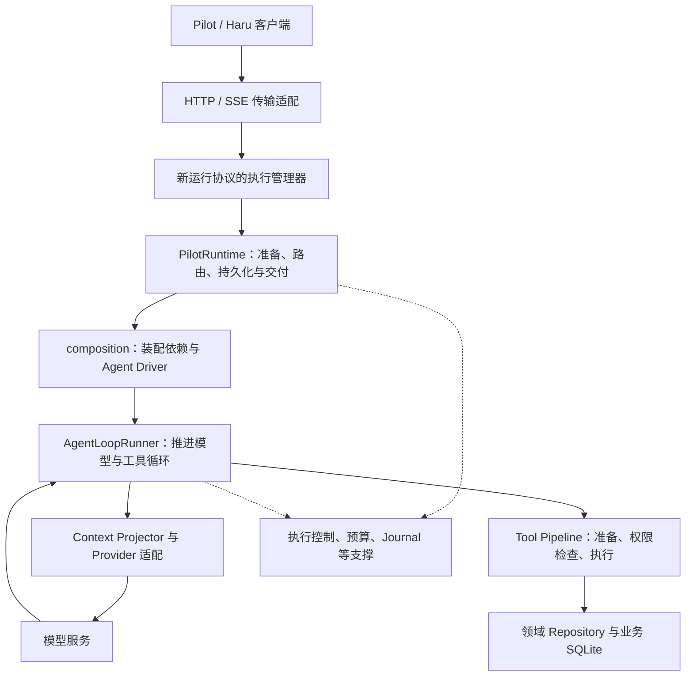

# 进阶二：Harness 怎样拆分职责，OfferPilot 为什么没有把一切塞进 Loop

如果只看上一章，似乎一个循环就能完成 Agent。真正放进求职产品后，还会遇到：请求重复到达、页面断连、等待确认、写入已完成但回复丢失。把这些事情全塞进循环，会让“下一步做什么”和“这次执行是否还有效”混在一起。

本篇按职责阅读 OfferPilot，不要求记住所有类名。源码基线见[进阶入口](README.md)。下图是代码职责图，箭头表达主要协作方向，不是完整调用栈，也不是微服务部署图。

## 先把三个决定分开

| 决定 | 谁主要负责 | 面试新增中的例子 |
| --- | --- | --- |
| 根据当前信息，建议下一步做什么 | 模型 | 先查目标投递，再请求新增面试 |
| 这次任务怎样接纳、运行、等待和交付 | Harness 的运行支撑 | 识别重复请求、组织执行段、等待确认、保存结果 |
| 这项业务操作是否合法、怎样保存 | 工具与领域仓库 | 检查投递归属、校验时间、写入面试事件 |

这种分工不意味着业务检查只能发生一次。工具入口与事务提交前可能都需要核对；只在页面上验证，不足以保护后端执行。

## 从入口走到业务写入

查看可编辑的 Mermaid 图源

这里单独标出了**新运行协议**：`/api/pilot/runtime/v1` 的后台执行由 manager 持有。旧 `/api/chat` 等入口保留原有生命周期，不能把新协议的断连行为套到所有接口上。

## Loop 和 Runtime 分别接住什么

`AgentLoopRunner` 处理模型输入、模型返回、工具分发和 Pending。它不会因为用户刷新页面，就自行决定创建另一个求职任务。

`PilotRuntime` 的 `start_turn()` 会先验证请求、加载会话、选择路径、检查已有 Pending，再组织模型执行与结果保存。部分动作可以走确定性路径，不必为了统一形式让所有功能都调用模型。

`composition.py` 将会话访问、工具策略、上下文、记录器和模型执行等依赖接起来，其中 `_AgentDriver` 调用 Runner。把装配与循环分开，可以在测试中替换模型或事件接收器，而不把生产业务保存规则一起替换掉。

当前文件本身仍然很大，内部类型和身份校验也很多。它是一个真实工程的职责拆分实例，不能仅凭分了目录就称为最小或最佳架构。

## 工具“可见”与工具“可执行”是两道边界

模型需要工具说明，知道有哪些功能可以请求。Context Projector 和工具选择逻辑准备这一层输入。

模型返回调用后，Tool Pipeline 还要检查参数、权限能力和记录范围。工具出现在模型输入里，不等于任何参数都能执行；隐藏工具也不能替代后端权限校验。

这种双重检查的价值是：即使模型选择错误，业务程序仍有机会拒绝。它也带来维护成本——提供给模型的工具契约与实际执行目录必须一致，不能分别维护两份逐渐漂移的列表。

## 四种记录，各回答一个问题

| 记录或身份 | 回答的问题 | 不能替代什么 |
| --- | --- | --- |
| Turn / Request Receipt | 这是不是同一次用户提交？是否已经接纳？ | 不能证明工具最终写入成功 |
| Execution / generation / lease | 当前是哪一段执行，谁还能继续提交？ | 不能替代用户对具体修改的确认 |
| Pending / Write Operation Ledger | 用户面对哪份建议，这项写操作到了什么状态？ | 不能当作所有模型调用的诊断日志 |
| Run / Segment / Journal | 模型和工具怎样推进，哪里发生异常？ | 不能作为恢复业务执行的唯一依据 |

英文名很多，但先抓住问题就容易理解：提交身份、执行资格、业务效果、诊断过程，是不同维度。

例如 Journal 关闭后，重复确认仍应被正确处理。否则，一个可选的诊断开关就改变了“会不会多保存一条”的业务语义。[ADR-0008](../../architecture/decisions/0008-persist-pilot-turns-and-timeline.md)明确记录了不使用 Journal 身份承担任务恢复的原因。

## 页面生命周期为什么从执行生命周期里拆出来

传统流式接口很容易形成“一个 HTTP 请求负责整个任务”的关系。用户断网，连接关闭，后台任务是否继续就会被传输细节牵着走。

[ADR-0010](../../architecture/decisions/0010-own-pilot-execution-in-runtime.md)记录了 OfferPilot 的取舍：新协议由单服务实例的 Runtime manager 持有有界工作池和队列，页面只订阅进度。

收益是重新打开页面可以观察原任务；代价是必须处理容量、超时、事件缓存、重同步和迟到结果。它并不承诺服务进程重启后自动续跑，也没有因此引入分布式任务队列。

## 把这些设计迁到自己的项目时

可以从具体失败模式决定边界，不必先复制所有类：

1. 只读问答：先把模型调用、工具契约和结果回填讲清。
2. 产生业务写入：增加具体审批、操作身份、事务与结果核对。
3. 页面可能断连、任务较长：再明确谁持有执行、怎样观察和取消。
4. 出错后需要排查：增加可选诊断，并防止它改变业务结果。

每一步都应该能说出“少了这一层会出现哪种错误”。如果某个组件只有名字，没有需要守住的条件，就还不能说明必须把它独立出来。

## 对照源码

| 入口 | 阅读目标 |
| --- | --- |
| [PilotRuntime.start_turn](https://github.com/offercontext/offerPilot/blob/c0a447bbe7be8976fe9a53c2bcbf3b91dad0eeac/src/offerpilot/pilot_runtime/service.py#L1957) | 校验、会话、路由与 Pending guard |
| [_AgentDriver](https://github.com/offercontext/offerPilot/blob/c0a447bbe7be8976fe9a53c2bcbf3b91dad0eeac/src/offerpilot/pilot_runtime/composition.py#L979) | Runtime 如何装配并调用 Runner |
| [RuntimeExecutionManager](https://github.com/offercontext/offerPilot/blob/c0a447bbe7be8976fe9a53c2bcbf3b91dad0eeac/src/offerpilot/pilot_runtime/managed_execution.py#L502) | 新协议的执行管理 |
| [runtime_transport.py](../../../src/offerpilot/runtime_transport.py) | 只读订阅如何变为 SSE，而不是另建执行者 |

这张职责图已经能够解释本章。实际界面无法直接证明这些模块边界，因此本章不安排一张“看起来像架构证据”的产品截图。

## 练习：日志系统不可用时怎么办

如果 Journal 暂时不可用，是否应该把用户确认过的新增请求再执行一次，让日志补齐？

参考思路

不应该。业务效果与诊断记录分属不同职责。先依据业务操作记录核对结果；诊断可以标记降级，不能为了补日志重做已经完成或结果未知的写入。

[上一篇：Agent Loop](01-agent-loop.md) · [下一篇：写操作审批](03-write-approval.md) · [返回进阶入口](README.md)
