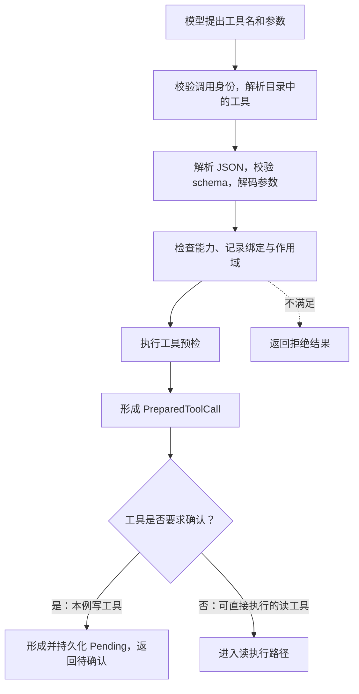
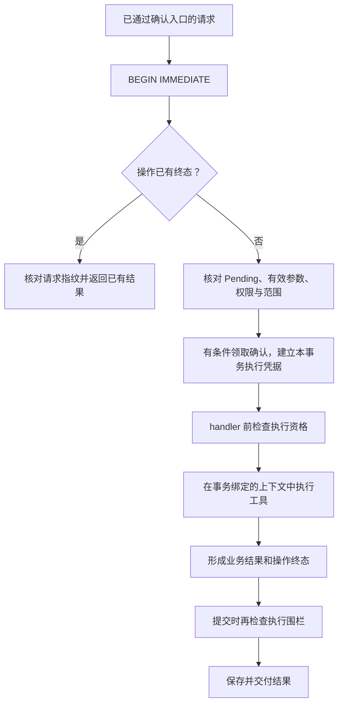

# 进阶三：从工具请求到数据库写入，确认机制到底约束了什么

“写之前弹出一个确认框”只描述了界面。后端还需要回答：确认的是哪项操作、哪份参数？两次确认谁可以执行？执行失败之后再收到请求，应返回什么？

这一章追踪 OfferPilot 的 typed 写工具路径，以新增面试事件为例。源码基线见[进阶入口](README.md)。下文的投递编号 `42`、操作编号和日期均为虚构教学数据。

## 从工具契约开始，而不是从弹窗开始

模型可以提出这样的参数：

```json
{
  "application_id": 42,
  "event_type": "interview",
  "scheduled_at": "2026-10-15T15:00:00+08:00",
  "duration_minutes": 60,
  "location": "线上"
}
```

这是 `create_application_event` 的参数示例，不是 HTTP 确认请求，也不是允许执行的凭据。

`application_event_specs()` 为该工具声明了输入 schema、`APPLICATION_EVENTS_WRITE` 能力、投递范围绑定、`confirmation_policy="required"`、具体 executor，以及展示和撤销相关元数据。模型只能提出参数，不能通过给 JSON 加一个 `approved: true` 就取得后端授权。

本章追踪的事件写工具明确要求确认。即使代码中存在兼容的自动批准配置，也不能据此推断这条 typed 路径会跳过 `required`；现有 Runner 测试专门检查了这一点。

## 第一次调用，只准备建议

`prepare_call()` 大致做下面这些事。每一步都可能拒绝请求，不是“模型给了 JSON 就直接 update”。



<details>
<summary>查看可编辑的 Mermaid 图源</summary>



</details>

`PreparedToolCall` 不只是一个可随意拼出来的参数字典。它关联到本次目录中的工具句柄、参数摘要和范围检查结果；执行阶段还会验证身份和阶段是否匹配。

暂停时，Runner 生成 `PendingAction`，绑定操作 ID、调用 ID、对话、建议版本及参数摘要。随后通过持久化回调保存待确认状态，再释放本段资源并返回。只生成一张前端卡片，没有这份后端身份，就不足以安全续接。

## 用户确认的对象是一份具体建议

| 信息 | 约束什么 |
| --- | --- |
| conversation / operation ID | 哪段对话中的哪项操作 |
| tool call ID / tool name | 哪次调用、哪个功能 |
| proposal / arguments digest | 原建议与参数是否匹配 |
| confirmation claim | 这份待确认建议是否已经被领取处理 |
| execution generation / owner | 当前执行是否仍有资格推进 |

用户在确认卡里修改时间，是合法需求，但要经过专门的编辑字段和有效参数校验。它与“拿旧确认偷偷换一份新参数”不同。不是所有字段都能编辑，尤其不能仅因为 schema 接受整数，就允许替换目标记录 ID。

## 关键检查为什么进事务

如果流程只是“查一下未执行 → 调用新增 → 标记完成”，两个请求可能同时读到未执行，最后新增两条。`WriteOperationCoordinator.execute_primary()` 使用 SQLite `BEGIN IMMEDIATE` 进入写事务，再读取操作并验证当前状态。

下面是这一事务路径的概要。图中没有展开所有撤销快照、展示投影和错误分支，不能直接当成可复制的实现。



<details>
<summary>查看可编辑的 Mermaid 图源</summary>



</details>

领取采用带条件的数据库更新：仍是原操作、原调用、原参数，且没有其他确认 claim。检查更新行数，才能知道自己是否真正取得这次执行机会。这类“只有原状态仍成立才更新”的做法常叫 CAS。

领域 executor 使用绑定到该事务的上下文。代码还使用嵌套事务处理业务执行失败，使局部业务改动与失败终态有明确的收敛路径。不能把这里推广为“调用外部网站也天然与本地数据库一起提交”；本章讨论的是当前本地事务写工具。

## 同一操作重来，不等于再执行一次

该版本的操作终态包含 `committed`、`failed`、`rejected`。遇到已有终态，协调器核对请求指纹并走结果复用，而不是因为用户又点了一次就重新调用 executor。

尤其需要分清：

- **同一操作已经明确失败**：重复确认可以返回既有失败；修改条件后重新尝试，是另一项需要核对的业务决定。
- **响应没回来，操作结果未知**：先核对原操作；不能把通信失败当作“数据库肯定没写”。
- **写入完成，后续模型回复失败**：保留已提交事实，不能为了补一句成功回复再次写入。

因此，幂等不是“任何错误都无限重试”。它首先需要明确什么算同一操作，以及已有结果如何被识别。

## 为什么还需要执行围栏

审批回答“用户批准了什么”，执行围栏回答“这次执行现在还能不能提交”。用户确认后仍可能点击停止，租约也可能失效。第三方请求和本地事务的边界不同，不能只在审批时检查一次就永久放行。

下一篇之后的[取消与恢复专题](05-cancellation-and-recovery.md)会继续追踪这层控制。本章先记住：确认凭据、操作幂等和执行资格分别处理不同问题，不能互相替代。

## 对照代码与现有测试

| 入口 | 重点 |
| --- | --- |
| [application_event_specs](https://github.com/offercontext/offerPilot/blob/c0a447bbe7be8976fe9a53c2bcbf3b91dad0eeac/src/offerpilot/ai/tool_specs/application_events.py#L447) | 输入字段、写能力、确认要求和 executor |
| [prepare_call / execute_prepared](https://github.com/offercontext/offerPilot/blob/c0a447bbe7be8976fe9a53c2bcbf3b91dad0eeac/src/offerpilot/ai/tool_runtime/pipeline.py#L85) | 准备与执行阶段的检查 |
| [execute_primary](https://github.com/offercontext/offerPilot/blob/c0a447bbe7be8976fe9a53c2bcbf3b91dad0eeac/src/offerpilot/ai/write_operations.py#L2344) | 事务、终态复用、领取和实际执行 |
| [写操作测试](../../../tests/test_write_operations.py) | 参数替换被拒绝、异常后的请求不重复执行 |

开发环境中可运行：

```sh
python -m pytest -q tests/test_write_operations.py::test_locked_modify_rejects_patch_prepared_mismatch_before_executor tests/test_write_operations.py::test_ordinary_executor_exception_terminalizes_without_rerun
```

后一项使用会抛错的测试 executor，提交同一操作两次，断言 executor 总共只调用一次，第二次返回结果复用。测试不连接真实模型，也不代表完整 UI 链路已验收。

### 同一份确认怎样对应到业务记录

真实演示中，刷新前后保留同一操作 `586f9441-6762-4276-9214-99651f1808c9`，工具为 `create_application_event`，日程数量为 0。确认后，该操作账本变为 `committed`，结果交付为 `completed`；同一个 Turn 的第 2 代执行完成。


接口返回日程 #1、`application_id=1`、`scheduled_at=2026-10-15T07:00:00Z`、60 分钟；[日历截图](../images/runtime-20261008/08-calendar-verified.jpg)显示北京时间 15:00–16:00，与[确认卡](../images/runtime-20261008/05-interview-pending.jpg)一致。没有编辑建议或事后修正时间。本次只点击了一次确认，未做重复提交竞态实验；重复执行防护仍由前述测试提供对应证据。[完整运行说明](../images/runtime-20261008/README.md)。

## 练习：按钮禁用够不够

第一个页面已经禁用确认按钮，第二个页面仍发来同一确认。后端最需要核对什么？

<details>
<summary>参考思路</summary>

核对同一操作身份、请求指纹、已有终态及确认 claim，并在事务内决定是否执行。按钮只是交互层；它不能阻止跨页面请求，也不能替代后台对重复提交的处理。

</details>

[上一篇：Harness 分层](02-harness-boundaries.md) · [下一篇：上下文投影](04-context-projection.md) · [返回进阶入口](README.md)
