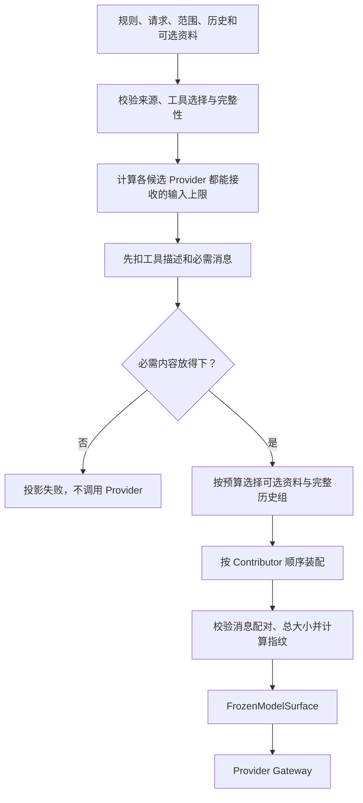
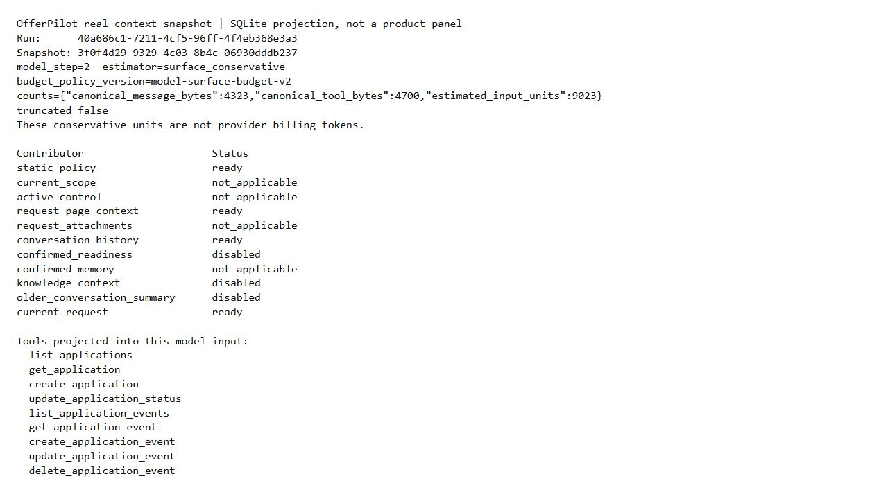

# 进阶四：模型真正收到了什么，OfferPilot 怎样装配一次输入

“上下文管理”不只是把长聊天截短。模型输入还包括固定规则、当前请求、工具描述、工具结果和有来源的数据。省掉不该省的内容，可能让模型把待确认误解为已完成；留下过多无关内容，则会浪费有限容量。

本篇追踪 `ModelSurfaceProjector`。源码基线见[进阶入口](README.md)，预算数字仅说明该版本的实现，不是某个模型的实际计费 token 或推荐参数。

## 把模型输入当作一次明确产物

OfferPilot 使用 `FrozenModelSurface` 表达一次准备好的模型输入：消息、工具契约、输入指纹及审计信息。这里的 surface 可以理解为“这一次真正交给模型看的完整内容”。

Projector 是确定性的组装过程，不需要再调用模型来决定每一段放哪里。相同的有效输入和策略应有可比较的投影结果，便于检查遗漏、过量或意外变化。



<details>
<summary>查看可编辑的 Mermaid 图源</summary>



</details>

这是依据源码绘制的输入装配图，不是某次用户请求的实际上下文截图。

## 第一笔预算：输出也需要空间

该版本的 `ProviderBudget.input_limit` 使用：

```text
可用输入 = 上下文窗口 - 输出预留 - 协议封装预留
本次输入上限 = min(产品上限, 每个候选 Provider 的可用输入)
```

默认配置中的 `32768 - 4096 - 1024 = 27648`，说明程序先给输出和协议封装留位置，再考虑输入。产品上限为 `65536`，也不意味着每个候选模型都能接收这么多。

尤其注意，当前 `conservative_units()` 把规范化内容的 **每个 UTF-8 字节计作一个估算单位**。这是一种保守且稳定的计数策略，不是真实 tokenizer 的逐 token 计数，也不能直接换算账单。

因此，一段中文的字符数、UTF-8 字节数和实际模型 token 数，不应在文档里混写成同一个量。

## 必需内容不能靠悄悄截断来“修好”

`_mandatory_messages()` 取固定规则、活动控制信息和当前请求；工具描述也先从预算里扣除。活动控制内容可能包含必须保留的工具结果等信息。

如果连必需内容都装不下，程序应明确失败。源码对必需工具结果导致的超额还有单独错误分类；它不会通过删掉“正在等确认”或半段工具结果来假装投影成功。

这里的取舍是：宁可明确告诉上层这次输入无法准备，也不悄悄改变执行条件。它会牺牲部分任务的直接可用性，需要上层做可解释的错误处理。

## 剩余内容怎样分配

在这一版本中，已确认准备资料、已确认记忆、知识内容和较早对话摘要，先共享至多四分之一的剩余预算。实际使用后，余量再按下列比例分给三类内容：

| 分组 | 初始份额 | 大致包含什么 |
| --- | --- | --- |
| scope | 25% | 当前范围与页面参考信息 |
| attachments | 35% | 本次附件资料 |
| history | 40% | 选中的历史对话组 |

这些是当前实现的初始份额，未使用的部分还会进入共享池，继续尝试装入剩余内容。不能把它理解为“历史永远恰好占总输入的 40%”。

举一个只用于算术理解的例子：扣完必需内容后剩 `10000` 单位，可选资料实际用了 `2000`，还剩 `8000`。三类初始份额分别为 `2000 / 2800 / 3200`。某一类用不满，余额还可以被其他类使用。这不是实际请求的预算报告。

## 历史要按完整关系选择

历史并非简单保留最后 N 条。程序把历史分组、排序、按组尝试装入，最后按原消息顺序组装，并校验消息完整性。

为什么按组？假设只保留一条 `tool` 结果，却删掉触发它的 assistant 调用，模型会收到缺少关联的消息；只保留请求、不保留结果，也可能让它误判进度。

摘要的条件更严格：[ADR-0011](../../architecture/decisions/0011-bound-optional-context-sources.md)规定，摘要只替换与来源一致的普通历史前缀。工具链、`provider_blocks` 和最近消息保留原文；摘要失效或没能纳入预算时，回退到原历史选择。并不是每次聊天都让另一个模型重新总结全部过去。

页面资料和附件还要与相邻的用途说明一起保留。只装入“不可信的原文”而丢掉解释其来源的规则，会改变材料的意义；源码会把不完整的数据封装整体省略。

## 工具选择和模型切换为什么也在这里

工具描述占输入空间。提供给模型的工具集合要与本段工具目录和权限视图相符，不能描述一个工具、实际却绑定另一个 executor。

同一次模型调用发生 Provider fallback 时，测试验证了继续复用同一份冻结输入。这样才能分清“换了服务商”与“换了输入”带来的差别，也避免第二个服务商悄悄拿到更大范围的资料。

这不表示任意服务商可以无损接续任意历史。模型适配仍须保留协议所需内容；预算选择的是共同可接受的边界，而不是无限兼容保证。

## 对照源码与检查

| 入口 | 看什么 |
| --- | --- |
| [budget.py](https://github.com/offercontext/offerPilot/blob/c0a447bbe7be8976fe9a53c2bcbf3b91dad0eeac/src/offerpilot/context_projector/budget.py#L20) | 输入预留、估算单位和份额 |
| [ModelSurfaceProjector.project](https://github.com/offercontext/offerPilot/blob/c0a447bbe7be8976fe9a53c2bcbf3b91dad0eeac/src/offerpilot/context_projector/projector.py#L58) | 必需内容、可选来源、历史、组装及校验 |
| [contracts.py](../../../src/offerpilot/context_projector/contracts.py) | Contributor 顺序与冻结输入类型 |
| [上下文测试](../../../tests/test_context_projector.py) | 超预算时是否在 Provider 前失败 |

```sh
python -m pytest -q tests/test_context_projector.py::test_projection_mandatory_overflow_fails_before_provider tests/agent_loop/test_runner.py::test_same_model_call_fallback_reuses_one_frozen_provider_surface
```

### 实际输入清单长什么样

下面是同一次新增面试请求中，第 2 个模型步的真实 `agent_context_snapshots` 选取字段。通过只读 SQL 导出后原样排版；产品没有因此新增一个“上下文面板”。



这一份快照记录了 4,323 字节消息和 4,700 字节工具定义，合计 9,023 个保守输入单位，`truncated=false`。清单列出 9 个可见工具；`knowledge_context` 等来源为 `disabled`，附件等为 `not_applicable`，不能据此说所有资料都进入了模型。这里没有保存或展示完整提示词、个人简历或凭据，也没有验证超预算截断场景。[文本输出](../images/runtime-20261008/13-context-manifest.txt)与[采集说明](../images/runtime-20261008/README.md)。

## 练习：同一句用户请求，为什么不是同一份输入

模型 A 和模型 B 收到相同用户问题，但其中一次漏了查询结果。还能直接用回答差异比较两个模型吗？

<details>
<summary>参考思路</summary>

不能据此把差异都归给模型。应先核对本次消息、工具集合、来源与投影结果，再讨论模型表现。输入指纹能帮助发现输入变化，但它本身不证明资料真实、权限正确或回答质量更好。

</details>

[上一篇：写操作审批](03-write-approval.md) · [下一篇：取消与恢复](05-cancellation-and-recovery.md) · [返回进阶入口](README.md)
