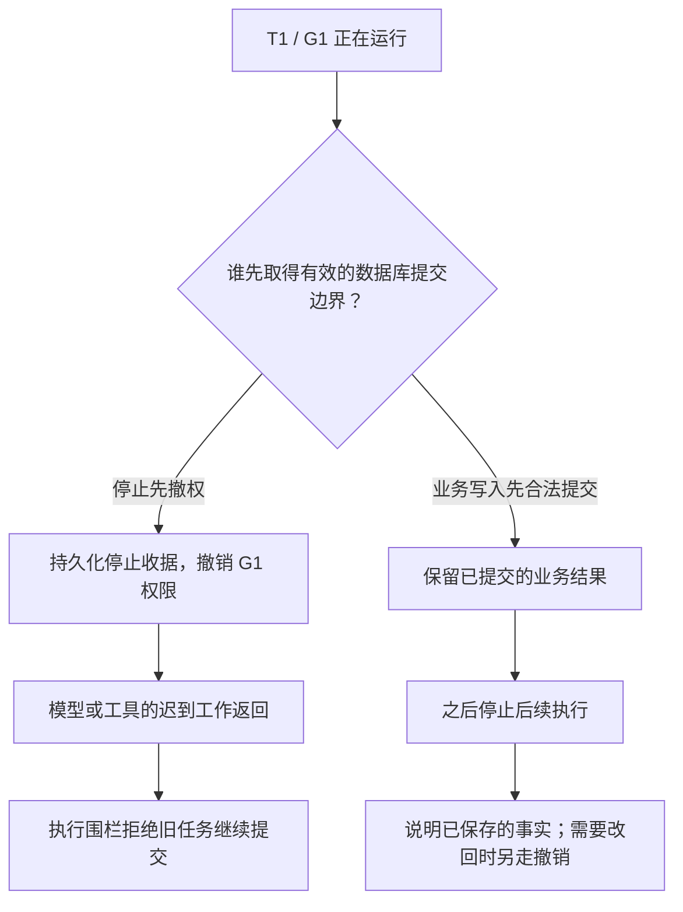
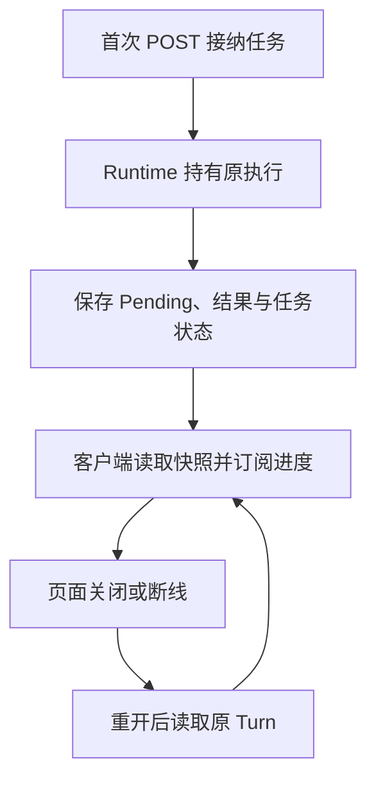

# 进阶五：取消、断线和重启，为什么需要不同的恢复设计

用户点击停止、浏览器断线、服务进程重启，看起来都会让聊天中断。但它们对执行资格、已有结果和下一步操作的影响不同。只保留一个 `cancelled = true`，很难覆盖这些情况。

本篇依据当前执行控制代码与 ADR-0009、ADR-0010。源码基线见[进阶入口](README.md)。图中的任务 T1、执行代次 G1 / G2 为教学代号，不是运行记录。

## 先分清三个对象

| 对象 | 用途 | 举例 |
| --- | --- | --- |
| Turn | 识别同一次用户任务 | T1：新增面试 |
| execution generation | 识别该任务某次取得执行资格的代次 | G1 等待确认后，批准进入 G2 |
| owner / lease | 识别当前拥有有限期执行资格的执行者 | 同一 owner 需要按时续租 |

为什么光有 Turn 不够？一个旧页面保存的“停止 T1”请求，可能在 T1 已批准并进入新执行代次时才到达。停止协议必须说清要停止哪一代，不能误伤后来获得资格的执行。

[ADR-0009](../../architecture/decisions/0009-fence-pilot-execution-control.md)规定停止携带 `command_id` 与 `expected_generation`。旧代次请求返回代次已变化，不能直接停止新代次；同一命令重传也需要复用原收据。

## 取消控制要落到提交边界

只在调用模型之前检查一次，会留下很大的时间窗口：模型运行期间用户停止了，模型后来仍可能返回保存请求。

OfferPilot 在循环的关键位置复查执行资格，`DurableRuntimeInvocationControl` 还会管理本地撤权标志与租约。真正的本地写入则在 handler 前和业务事务提交边界检查持久执行身份。



<details>
<summary>查看可编辑的 Mermaid 图源</summary>



</details>

图展示的是数据库先后关系，不表示所有外部动作都能撤回。发给服务商的模型请求可能仍在计算，逻辑停止不能保证线程立即退出或费用立即停止。

执行围栏也不能只检查“当前状态是 running”。还要确认是原 owner、原 generation、原 Conversation，且租约仍有效，否则旧 worker 可能借新任务的 running 状态提交结果。

## 租约为何需要“到期就失效”

租约可以理解为有期限的执行资格。`DurableRuntimeInvocationControl` 启动心跳续租，并同时检查本地单调时限和仓库中的当前状态。

该版本中，续租失败或续租返回时已经越过原期限，会撤销本地 scope，并尝试收敛为 `result_unknown`。它不会因为迟到的心跳最终成功，就重新授予旧执行资格。

这里宁可留下待核对，也不把未知结果解释成“没有执行，可以自动再来一遍”。具体时钟和锁竞争处理比较复杂，但目的很明确：过去有效的执行身份不能无限沿用。

## 页面断线后，为什么可以只恢复观察

在新 `/api/pilot/runtime/v1` 协议中，Runtime manager 持有执行；SSE 订阅负责把进度送到页面。关闭订阅不会自动等于停止任务。



<details>
<summary>查看可编辑的 Mermaid 图源</summary>



</details>

“重开后读取原 Turn”没有指回首次 POST。重新观察不应该创建新任务、重复写入或重置预算。游标失效或缓存溢出时，应重新读取快照，而不是重放用户请求。

这个结论只适用于明确的新协议任务。旧聊天接口保留原有断连生命周期；截图和教学实验必须记录使用了哪种接口，不能混用两套行为。

## 服务重启后，不承诺自动续跑

页面断线时，服务内的原 worker 可能还活着；服务进程重启则不同，原 worker 已不存在。

| 重新打开时读到什么 | 可以做什么 | 不能据此做什么 |
| --- | --- | --- |
| 已完成与已保存结果 | 恢复展示既有结果 | 再执行一遍业务操作 |
| 有效待确认建议 | 展示并等待明确决定，继续前重新核对 | 从旧聊天里的“好”推断已经批准 |
| 原任务仍在当前服务实例运行 | 按新协议重新订阅 | 新建第二个执行者代跑 |
| 中断、租约失效或结果未知 | 核对持久事实并说明不确定性 | 进程重启后自动重跑 Provider 或未知工具 |

[ADR-0010](../../architecture/decisions/0010-own-pilot-execution-in-runtime.md)明确限定为单实例执行管理。持久状态解决识别与核对，不能被宣传成跨进程自动恢复完整模型执行。

等待确认也不是一个一直占着 worker 的 `while`。初段返回后，确认入口核对 Pending，并为有效批准取得相应的新执行身份，继续处理那份具体操作。

## “执行结果”和“结果交付”还可能分开

业务写入成功后，最终消息保存或网络发送仍可能失败。此时应该根据已提交结果整理回执，不能重跑 executor。

代码为超时后的固定结果整理提供独立的终态恢复 scope，并继续核对原身份；它不是给旧 worker 恢复一般执行权限的后门，也不能用来发起新的模型或业务写操作。

这也是为什么一个简单的 `finally: status = completed` 不够。旧执行的清理不能覆盖停止状态，更不能覆盖新代次的状态。

## 对照代码和测试

| 入口 | 看什么 |
| --- | --- |
| [DurableRuntimeInvocationControl](https://github.com/offercontext/offerPilot/blob/c0a447bbe7be8976fe9a53c2bcbf3b91dad0eeac/src/offerpilot/pilot_runtime/turn_control.py#L22) | 取消、超时、续租和 scope |
| [pilot_control.py](../../../src/offerpilot/pilot_control.py) | 持久执行身份、停止命令和提交围栏 |
| [managed_execution.py](../../../src/offerpilot/pilot_runtime/managed_execution.py) | 执行管理、快照和订阅 |
| [test_pilot_control.py](../../../tests/test_pilot_control.py) | 提交前到期、停止与提交先后关系 |

```sh
python -m pytest -q tests/test_pilot_control.py::test_fence_rejects_a_lease_that_expired_before_commit
```

这项测试在事务中修改记录，然后模拟租约到期，断言提交被拒绝且原记录没有被该事务改写。它比“按钮显示已停止”更接近后端要守住的条件。

> **运行截图占位 A5｜尚未采集。** 后续分别采集新运行协议下的断线重连、显式停止两组素材：记录相同 Turn 与 generation，展示重开后的状态和业务结果。服务重启属于第三组独立实验，不能用“关闭浏览器”代替。若最终结果未知，截图中应保留待核对状态。

## 练习：旧停止请求到达新代次

原任务已经从 G1 进入 G2。一个携带 `expected_generation=G1` 的停止请求现在才到达，应该直接停止 G2 吗？

<details>
<summary>参考思路</summary>

不应该。这个命令只针对原执行代次，需要返回代次变化等相应状态，让客户端核对。否则一个迟到页面就可能撤销用户后来批准的新执行。

</details>

[上一篇：上下文投影](04-context-projection.md) · [下一篇：运行记录与验证](06-observability-and-validation.md) · [返回进阶入口](README.md)
