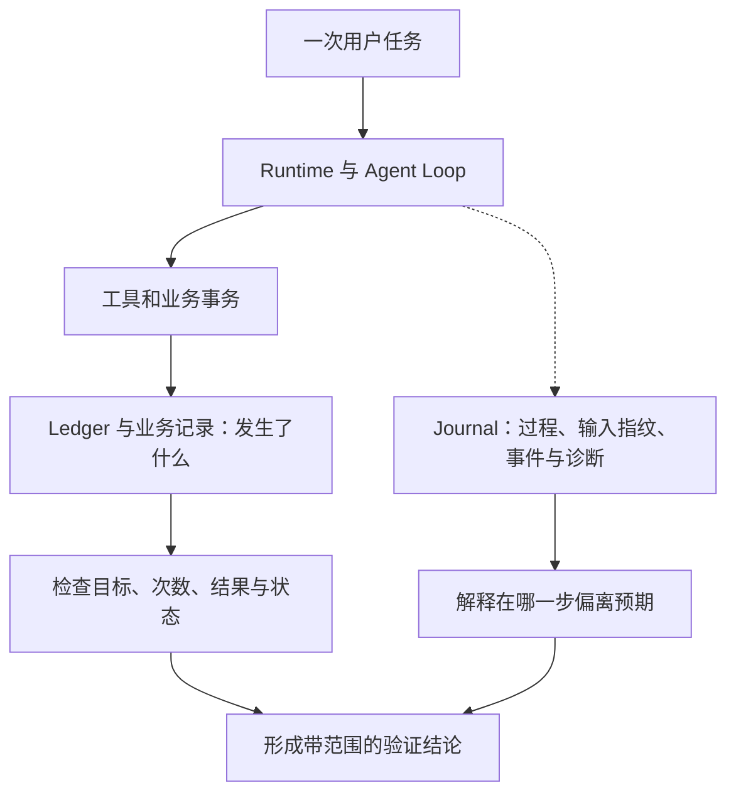
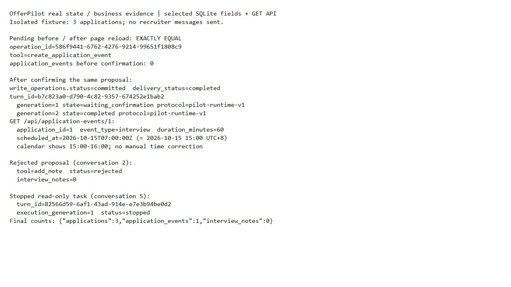

# 进阶六：怎样证明 Harness 守住了规则，而不只是在演示里答得漂亮

循环、审批、上下文和停止机制都有了，接下来要验证它们怎样配合。不能只看最终一句“记好了”，也不能为了方便排错，把所有个人资料都无限保存到日志。

本篇结合 OfferPilot 的 Journal、运行预算和现有测试。源码基线、实际执行的检查范围见[进阶入口](README.md)。故障表是教学推演，不是线上事故记录。

## 先决定“正确”在哪里核对

| 想检查什么 | 应看哪种证据 |
| --- | --- |
| 是否只新增了一场面试 | 业务记录及写操作结果 |
| 为什么模型继续调用工具 | 当时的输入、模型返回与工具结果 |
| 停止后旧执行是否继续提交 | 执行身份、提交围栏和持久结果 |
| 日志损坏是否拖住任务 | 记录器预算、降级状态和业务结果 |
| 改提示词后是否更会理解需求 | 相同条件下的真实模型评估 |

证据可以相互关联，但不能互相冒充。固定返回的测试模型证明程序分支，不证明真实模型理解能力；产品截图证明界面当时显示了什么，不单独证明没有重复写入。

## Journal 记录运行过程，Ledger 记录写操作事实

Journal 使用 Run、Segment 和事件描述执行过程。一次等待确认前后的工作可以关联起来，同时区分不同执行段。具体请求、工具调用及其结果应有可关联的身份。

写操作 Ledger 则保存操作状态与已形成的结果，承担重复请求和结果核对等业务职责。OfferPilot 不把可选 Journal 当作任务恢复的唯一依据。



<details>
<summary>查看可编辑的 Mermaid 图源</summary>



</details>

虚线表示诊断协作，不表示 Journal 可以绕过业务事务，也不保证所有诊断写入都在同一个事务中。具体绑定方式仍要看对应实现。

## 日志为什么也需要预算

如果每一步都同步写一份巨大日志，模型和工具很快完成，记录过程却卡住了，用户仍会觉得助手没有结束。

`SafeRunRecorder` 采用带预算的降级设计。该版本常规记录工作在一个 Segment 内累计使用约 **150 ms 的 active-work 预算**，单次操作另有上限；终态整理有独立预算。这里算的是记录器实际工作的时间，不是模型等待和用户等待加起来的总时长。

“日志可降级”也不等于吞掉任何错误并继续写业务数据。诊断失效与业务授权失效是不同问题。Journal 记录失败可以标记 degraded；执行资格不成立时，业务提交仍要停止。

日志结构本身还需要限定字段、大小和来源。[现有 Journal 测试](../../../tests/test_agent_run_journal.py)覆盖未知或敏感字段、过大内容和预算边界。读取诊断信息时仍须遵守权限，不能为了方便教学把原始简历或密钥写进公开图例。

## 三种预算不要混在一起

| 预算 | 限制对象 | OfferPilot 入口 |
| --- | --- | --- |
| 上下文预算 | 一次模型请求能提供多少内容 | `context_projector/budget.py` |
| 运行预算 | 任务 deadline、模型调用、工具调用及事件资源 | `pilot_runtime/execution_budget.py` |
| Journal 预算 | 诊断记录实际消耗的工作时间 | `agent_runtime/budget.py` |

例如等待队列的时间计入运行 deadline；模型真正发起前要预留调用额度；关闭 Journal 不应让模型调用次数变得无限。反过来，也不能用“日志预算还没用完”来增加工具执行额度。

## 从失败条件组织验证

围绕一项需要确认的新增操作，可以建立这样一组检查：

| 人为安排的情境 | 需要守住的条件 |
| --- | --- |
| 模型提出写工具，尚未确认 | 产生 Pending，executor 调用次数仍为零 |
| 同一确认重复到达 | 不产生第二次业务效果，返回相同操作的已知结果 |
| executor 明确抛错 | 保存可核对的失败，重复请求不无条件重跑 |
| 写入完成，后续模型失败 | 原 executor 不再执行 |
| 必需上下文超出预算 | 在 Provider 调用前明确失败 |
| 租约在提交前失效 | 该受保护事务无法提交 |
| 记录器两次工作间隔很久 | 不把空闲间隔误算成 Journal 工作时间 |
| 运行任务一直排队 | 不因开始执行较晚而重新起算 deadline |

这不是覆盖全部产品路径的测试清单。它帮助读者把抽象机制变成可观察的反例，而不是写一条只检查“调用过某函数”的测试。

## 读一个断言，比只看测试名字更有用

`test_ordinary_executor_exception_terminalizes_without_rerun` 的重点可以概括为：

```python
first = execute_same_operation()
replay = execute_same_operation()
assert first.is_failed
assert replay.is_replay
assert executor_call_count == 1
```

这是对真实测试意图的教学改写，不是仓库中的类属性或可直接运行代码。真实测试使用 `OperationFailed`、`OperationReplay` 和计数器，入口见[写操作测试](../../../tests/test_write_operations.py)。

先故意让 executor 抛错，再核对第二次没有重跑，才能证明它处理了那个失败模式。正常路径成功不回答这个问题。

## 可以在开发环境中实际检查的三个边界

```sh
python -m pytest -q tests/test_agent_run_journal.py::test_active_work_budget_ignores_gap_between_recorder_calls tests/pilot_runtime/test_execution_budget.py::test_runtime_budget_counts_agent_and_title_model_calls_together tests/pilot_runtime/test_execution_budget.py::test_runtime_budget_deadline_is_absolute_and_queue_wait_is_consumed
```

这些测试使用受控时钟或模拟条件，不要求真实模型密钥。源码阅读与局部测试之后，仍需要真实模型任务集检查意图理解、工具选择与建议质量；UI、断网、重启等端到端实验也要另行记录条件和结果。

### 日志不完整，但业务确实已经保存

新增面试这次运行提供了一个具体对照：[运行日志截图](../images/runtime-20261008/12-agent-loop.jpg)里的 Run 仍显示 `waiting_confirmation`，且 `recording_status=degraded`，只留下前 14 条事件。与此同时，操作账本已经提交，同一 Turn 的第 2 代执行完成，日程接口和页面也能查到保存结果。



因此不能用这条不完整的 Run 状态否定已经提交的业务事实，也不能伪造缺失的 Segment 或工具完成事件。另一次“新增日程”被误解为“添加复盘”的错误建议也保留在[入门第 11 篇](../11-how-to-follow-an-execution.md)。这是少量真实案例的证据，尚不是模型质量评估集或完整可靠性验收。[来源、字段与未覆盖范围](../images/runtime-20261008/README.md)。

## 对照源码

| 入口 | 阅读目标 |
| --- | --- |
| [SafeRunRecorder](https://github.com/offercontext/offerPilot/blob/c0a447bbe7be8976fe9a53c2bcbf3b91dad0eeac/src/offerpilot/agent_runtime/journal.py#L252) | 记录器封装、降级与工作预算 |
| [ActiveWorkBudget](https://github.com/offercontext/offerPilot/blob/c0a447bbe7be8976fe9a53c2bcbf3b91dad0eeac/src/offerpilot/agent_runtime/budget.py#L64) | 仅累计实际工作时间 |
| [RuntimeBudget](https://github.com/offercontext/offerPilot/blob/c0a447bbe7be8976fe9a53c2bcbf3b91dad0eeac/src/offerpilot/pilot_runtime/execution_budget.py#L104) | 排队 deadline、调用额度与资源计数 |

## 从这六篇带走什么

现在可以从一次具体任务追踪：模型输入怎样形成，Loop 怎样推进，写操作怎样取得授权，状态怎样保存，旧执行怎样失去资格，结果又怎样被核对。

理解 OfferPilot 的设计，也包括理解它的范围：这里以本地 SQLite、单服务实例、新旧协议并存为背景。迁到另一个产品时，要重新检查业务副作用、权限、运行方式和故障模型，不能只复制文件名。

[上一篇：取消与恢复](05-cancellation-and-recovery.md) · [返回进阶入口](README.md) · [回看入门总览](../22-putting-the-harness-together.md)
